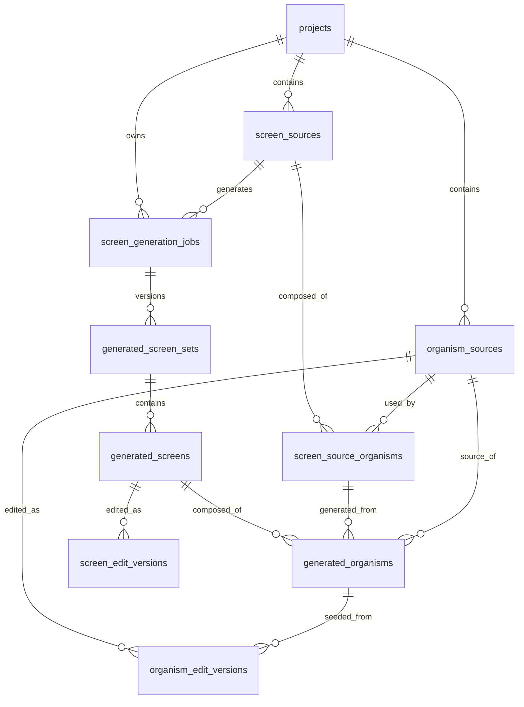

# RND Screen Generator 데이터 맵

## 1. 문서 책임

이 문서는 MVP 기준의 데이터 테이블, 각 테이블 책임, 스키마, 주요 관계만 정의한다.

DB 구조 검토와 ERD 산출물은 `drawdb`를 함께 사용한다. 이 문서가 텍스트 기준 SSOT이고, `drawdb` 파일은 테이블 관계와 컬럼 구조를 시각 검토하기 위한 보조 산출물로 관리한다.

제품 범위는 [MASTER_PLAN.md](/Users/plusx/Documents/rnd-screen-generator/MASTER_PLAN.md), 시스템 경계는 [DEVELOPMENT_ARCHITECTURE.md](/Users/plusx/Documents/rnd-screen-generator/docs/development/DEVELOPMENT_ARCHITECTURE.md)를 따른다.

## 2. 설계 원칙

- MVP는 JSONB 중심으로 단순하게 시작한다.
- `kind.ts`의 `SPEC_KINDS`를 모듈 기준 데이터로 사용한다.
- DB에는 모듈 식별자로 `module`을 저장한다.
- 원천 JSON의 모듈 식별자는 `module`로 통일한다. 외부 수급 데이터에 `moduleKind`가 있으면 import 단계에서만 `module`로 정규화한다.
- 화면 생성용 mock 데이터는 `docs/data-mockups/` 아래 단계별 디렉토리로 관리한다.
- screen source 원본 JSON은 `screen_sources.source_json`에 보존한다.
- organism source 원본 JSON은 `organism_sources.source_json`에 보존한다.
- 한 번의 생성 결과 묶음은 `generated_screen_sets`에 저장한다.
- 실제 생성된 개별 화면은 `generated_screens`에 저장한다.
- Base Screen과 각 엣지 케이스 Variant는 모두 `generated_screens`의 row로 본다.
- 생성된 OGN 섹션은 `generated_organisms`에 저장한다.
- Puck Screen 편집 결과는 Screen composition 버전으로 `screen_edit_versions`에 저장한다.
- Puck OGN 편집 결과는 공유 OGN 버전으로 `organism_edit_versions`에 저장한다.
- 같은 `organism_source_id`를 공유하는 화면은 기본적으로 최신 발행 OGN 편집 버전을 렌더링한다.
- 테이블/관계 변경 시 SQL 스키마와 `drawdb` ERD를 함께 갱신한다.

## 3. data-mockups 운영 기준

`docs/data-mockups/`는 실제 DB migration이 아니라 수급 문서, 디자인 명세, 정규화 JSON, 생성 컨텍스트의 샘플 계약을 검토하기 위한 mock 데이터 영역이다.

| 디렉토리 | 책임 |
|---|---|
| `1-design-specs/` | 디자인 토큰, 컴포넌트, 레이아웃 helper 등 생성에 필요한 디자인 입력 |
| `1-policy-inputs/` | 유즈케이스, 프로세스, function, 정책 그룹, 정책 항목 등 정책서 기반 입력 |
| `2-spec-inputs/` | screen route, screen, organism, component 등 화면 명세 입력 |
| `3-parsed-jsons/` | 프론트엔드가 직접 쓰기 좋은 join/parse 결과와 display preview read model 샘플 |
| `4-generation-contexts/` | Claude 화면 생성을 위한 최종 컨텍스트 샘플 |
| `5-feedback-loops/` | 생성 결과 검수, 피드백, 재생성 입력 샘플 |

mock JSON 관계는 아래 방향을 기준으로 한다.

```text
module
└─ usecase
   └─ process
      ├─ function
      │  └─ functionPolicyGroup -> policyGroup
      └─ screenRoute
         └─ screenVariant
            └─ screen
               └─ organism
                  └─ componentUsage -> component

policyGroup
└─ policy
```

하위 row가 상위 code를 명시적으로 바라본다. 예를 들어 `functions[].processCode`, `screenRoutes[].processCode`, `screenVariants[].screenRouteCode`, `screenSources[].screenVariantCode`, `screenSources[].organisms[].organismCode`, `organism.components[].componentCode`를 사용한다.

mock JSON에서 배열 FK가 필요해 보이는 경우에도 먼저 별도 사용/연결 엔티티로 분리한다. 예를 들어 `functionPolicyGroups[]`, `screenSources[].organisms[]`, `organism.variants[].visibleComponents[]`처럼 표현한다.

디스플레이 프리뷰에서 사용하는 화면 상세 JSON은 SQL 적재 대상이 아니라 `screen`, `organism`, `component`, `function`, `policy` 관계를 조합한 조회용 read model이다. 스키마 기준은 [DISPLAY_PREVIEW_SCHEMA.md](/Users/plusx/Documents/rnd-screen-generator/docs/development/DISPLAY_PREVIEW_SCHEMA.md)를 따르고, 샘플은 `docs/data-mockups/3-parsed-jsons/display-preview-screen.json`에 둔다.

## 4. drawdb 운영 기준

- `drawdb`는 Supabase PostgreSQL 테이블의 ERD 검토 도구로 사용한다.
- drawdb 원본 산출물은 `docs/drawdb/`에 둔다.
- drawdb SQL import 원본은 `docs/drawdb/rnd-screen-generator.postgres.sql`로 관리한다.
- 리뷰용 이미지 export는 `docs/drawdb/exports/`, 변경 시점별 보관본은 `docs/drawdb/snapshots/`에 둔다.
- 테이블명, 컬럼명, nullable, primary key, foreign key는 이 문서의 SQL 스키마와 일치해야 한다.
- JSONB 내부 구조는 `drawdb`에 과하게 펼치지 않고, 컬럼 단위로만 표현한다.
- 최종 migration의 기준은 SQL이며, `drawdb`는 리뷰와 커뮤니케이션을 위한 시각 산출물이다.

## 5. MVP 테이블 책임

| 테이블 | 역할 |
|---|---|
| `projects` | 작업 공간 단위 |
| `screen_sources` | 입력 화면 JSON과 화면 소스 인덱스 |
| `organism_sources` | 입력 organism JSON과 organism 소스 인덱스 |
| `screen_source_organisms` | screen source와 organism source 연결 |
| `screen_generation_jobs` | 생성 작업 |
| `generated_screen_sets` | 생성/재생성 화면 묶음 |
| `generated_screens` | 생성된 개별 화면 |
| `generated_organisms` | 생성된 화면 안의 OGN 섹션 |
| `screen_edit_versions` | Screen에서 OGN 추가/제거/순서 변경한 편집 버전 |
| `organism_edit_versions` | 공유 OGN 내부 컴포넌트 위치/순서/Variant/Props 편집 버전 |

## 6. 관계 개요



## 7. 공통 컬럼 규칙

| 컬럼 | 규칙 |
|---|---|
| `id` | `uuid primary key default gen_random_uuid()` |
| `module` | `kind.ts`의 `kind` 값. 예: `mbr`, `pay`, `join` |
| `created_at` | `timestamptz not null default now()` |
| `updated_at` | 변경 가능한 테이블에만 사용 |
| `metadata` | 자주 조회하지 않는 확장 필드 보관 |
| `source_json` | 입력 원본 JSON 보존 |
| `normalized_json` | 시스템 내부 표준 JSON |
| `raw_item` | 원천 JSON 배열의 특정 항목 보존 |

## 8. 테이블별 스키마

### projects

프로젝트 작업 공간을 저장한다.

```sql
create table projects (
  id uuid primary key default gen_random_uuid(),
  name text not null,
  description text,
  created_by uuid,
  created_at timestamptz not null default now(),
  updated_at timestamptz not null default now()
);
```

### screen_sources

화면 입력 JSON과 화면 단위 정보를 저장한다.

`transitions`, `policy_groups`, `features`는 MVP에서 JSONB로 유지한다. 화면별 base/edge 케이스는 `screen_variants` 관계로 분리한다.

```sql
create table screen_sources (
  id uuid primary key default gen_random_uuid(),

  project_id uuid not null references projects(id) on delete cascade,
  module text not null,

  screen_code text not null,
  name text not null,
  description text,
  route_path text,
  implementation_type text,

  policy_groups jsonb not null default '[]'::jsonb,
  features jsonb not null default '[]'::jsonb,
  transitions jsonb not null default '[]'::jsonb,

  source_name text,
  source_hash text,
  source_json jsonb not null,
  schema_version text not null,
  normalized_json jsonb not null,
  validation_status text not null,
  validation_warnings jsonb not null default '[]'::jsonb,

  author text,
  document_version text,
  written_at date,
  metadata jsonb not null default '{}'::jsonb,

  created_at timestamptz not null default now(),
  updated_at timestamptz not null default now(),

  constraint uq_screen_sources_project_module_code
    unique (project_id, module, screen_code),
  constraint chk_screen_sources_validation_status
    check (validation_status in ('valid', 'warning', 'failed'))
);
```

추천 인덱스:

```sql
create index idx_screen_sources_project_module
on screen_sources(project_id, module);

create index idx_screen_sources_source_json_gin
on screen_sources using gin(source_json);
```

### organism_sources

organism 입력 JSON과 organism 내부 정보를 저장한다.

`components`, `case_branches`, `policies`, `policy_groups`, `features`는 MVP에서 JSONB로 유지한다.

```sql
create table organism_sources (
  id uuid primary key default gen_random_uuid(),

  project_id uuid not null references projects(id) on delete cascade,
  module text not null,

  organism_source_code text not null,
  name text not null,
  description text,
  layout text,
  visibility_rule text,
  visibility_cases jsonb not null default '[]'::jsonb,

  components jsonb not null default '[]'::jsonb,
  case_branches jsonb not null default '[]'::jsonb,
  policies jsonb not null default '[]'::jsonb,
  policy_groups jsonb not null default '[]'::jsonb,
  features jsonb not null default '[]'::jsonb,

  source_name text,
  source_hash text,
  source_json jsonb not null,
  schema_version text not null,
  normalized_json jsonb not null,
  validation_status text not null,
  validation_warnings jsonb not null default '[]'::jsonb,

  author text,
  document_version text,
  written_at date,
  metadata jsonb not null default '{}'::jsonb,

  created_at timestamptz not null default now(),
  updated_at timestamptz not null default now(),

  constraint uq_organism_sources_project_module_code
    unique (project_id, module, organism_source_code),
  constraint chk_organism_sources_validation_status
    check (validation_status in ('valid', 'warning', 'failed'))
);
```

추천 인덱스:

```sql
create index idx_organism_sources_project_module
on organism_sources(project_id, module);

create index idx_organism_sources_components_gin
on organism_sources using gin(components);

create index idx_organism_sources_source_json_gin
on organism_sources using gin(source_json);
```

### screen_source_organisms

특정 화면이 어떤 organism으로 구성되는지 저장한다.

연결 대상 organism JSON이 아직 없거나 해석되지 않은 경우를 위해 `organism_source_id`는 nullable이다.

```sql
create table screen_source_organisms (
  id uuid primary key default gen_random_uuid(),

  project_id uuid not null references projects(id) on delete cascade,
  screen_source_id uuid not null references screen_sources(id) on delete cascade,
  organism_source_id uuid references organism_sources(id) on delete set null,
  module text not null,

  organism_source_code text not null,
  section_no text not null,
  area_type text,
  area_description text,
  area_layout text,

  organism_name text,
  organism_description text,

  server_controls jsonb not null default '[]'::jsonb,
  min_count integer,
  max_count integer,
  priority integer,
  error_handling text,

  raw_item jsonb not null default '{}'::jsonb,

  created_at timestamptz not null default now(),
  updated_at timestamptz not null default now(),

  constraint uq_screen_source_organisms_section
    unique (screen_source_id, section_no)
);
```

추천 인덱스:

```sql
create index idx_screen_source_organisms_screen_priority
on screen_source_organisms(screen_source_id, priority);

create index idx_screen_source_organisms_screen_organism_source_code
on screen_source_organisms(screen_source_id, organism_source_code);

create index idx_screen_source_organisms_project_module
on screen_source_organisms(project_id, module);
```

### screen_generation_jobs

특정 화면에 대한 생성 작업을 저장한다.

Claude 생성, Codex 검수, Agent SDK 실행 경로는 이 테이블에 기록한다.

```sql
create table screen_generation_jobs (
  id uuid primary key default gen_random_uuid(),

  project_id uuid not null references projects(id) on delete cascade,
  screen_source_id uuid not null references screen_sources(id) on delete cascade,
  module text not null,

  status text not null,

  generation_model text,
  review_model text,
  generation_execution_mode text,
  review_execution_mode text,
  generation_session_id text,
  review_session_id text,

  instruction text,
  selected_organism_source_ids uuid[],
  selected_screen_source_organism_ids uuid[],

  latest_set_id uuid,
  created_by uuid,

  created_at timestamptz not null default now(),
  updated_at timestamptz not null default now(),

  constraint chk_screen_generation_jobs_status
    check (status in ('pending', 'completed', 'failed')),
  constraint chk_screen_generation_jobs_generation_execution_mode
    check (generation_execution_mode is null or generation_execution_mode in ('local_session', 'remote_api')),
  constraint chk_screen_generation_jobs_review_execution_mode
    check (review_execution_mode is null or review_execution_mode in ('local_session', 'remote_api'))
);
```

추천 인덱스:

```sql
create index idx_screen_generation_jobs_screen
on screen_generation_jobs(screen_source_id, created_at desc);

create index idx_screen_generation_jobs_project_module
on screen_generation_jobs(project_id, module, created_at desc);
```

### generated_screen_sets

생성/재생성 결과 묶음을 버전 단위로 저장한다.

Base Screen과 Screen Variant의 화면 레벨 정보는 `generated_screens`가 소유한다. 화면 안의 OGN 섹션과 컴포넌트 JSON은 `generated_organisms`가 소유한다.

```sql
create table generated_screen_sets (
  id uuid primary key default gen_random_uuid(),

  job_id uuid not null references screen_generation_jobs(id) on delete cascade,
  parent_set_id uuid references generated_screen_sets(id) on delete set null,

  version_number integer not null,
  feedback text,

  prompt text not null,
  prompt_inputs jsonb not null default '{}'::jsonb,

  validation_status text not null,
  validation_errors jsonb not null default '[]'::jsonb,

  review_status text,
  review_result jsonb,
  runtime_diagnostics jsonb,

  created_at timestamptz not null default now(),

  constraint uq_generated_screen_sets_number
    unique (job_id, version_number),
  constraint chk_generated_screen_sets_validation_status
    check (validation_status in ('valid', 'invalid')),
  constraint chk_generated_screen_sets_review_status
    check (review_status is null or review_status in ('pending', 'passed', 'failed', 'needs_regeneration'))
);
```

추천 인덱스:

```sql
create index idx_generated_screen_sets_job
on generated_screen_sets(job_id, version_number desc);
```

### generated_screens

생성된 실제 화면 하나를 저장한다.

Base Screen도 하나의 row이고, 각 Screen Variant도 하나의 row다. 이 테이블은 화면 레벨 정보만 소유하고, 섹션/컴포넌트 생성 결과는 `generated_organisms`가 소유한다.

```sql
create table generated_screens (
  id uuid primary key default gen_random_uuid(),

  set_id uuid not null references generated_screen_sets(id) on delete cascade,

  screen_type text not null,
  screen_code text not null,
  source_screen_code text,
  source_variant_code text,

  title text,
  trigger text,
  difference_from_base text,
  follow_up text,

  layout_json jsonb not null default '{}'::jsonb,
  chrome_json jsonb not null default '{}'::jsonb,

  review_status text,
  review_result jsonb,

  created_at timestamptz not null default now(),
  updated_at timestamptz not null default now(),

  constraint chk_generated_screens_screen_type
    check (screen_type in ('base', 'variant')),
  constraint chk_generated_screens_review_status
    check (review_status is null or review_status in ('pending', 'passed', 'failed', 'needs_regeneration')),
  constraint uq_generated_screens_set_code
    unique (set_id, screen_code)
);
```

추천 인덱스:

```sql
create index idx_generated_screens_set
on generated_screens(set_id, screen_type, screen_code);

create index idx_generated_screens_layout_json_gin
on generated_screens using gin(layout_json);

create index idx_generated_screens_chrome_json_gin
on generated_screens using gin(chrome_json);
```

### generated_organisms

생성된 화면 안의 OGN 섹션 하나를 저장한다.

OGN은 대부분 화면 섹션에 해당하므로, 이 테이블이 섹션 layout과 하위 component JSON을 함께 소유한다.

`screen_source_organism_id`는 생성된 OGN 섹션이 원천 screen-organism 구성의 어느 row에서 왔는지 추적하기 위한 선택적 연결이다.

이 테이블은 AI 생성 시점의 화면별 OGN snapshot이다. 사용자가 발행한 공유 OGN 편집본은 `organism_edit_versions`에 저장하고, 같은 `organism_source_id`를 쓰는 다른 화면에도 적용한다.

```sql
create table generated_organisms (
  id uuid primary key default gen_random_uuid(),

  generated_screen_id uuid not null references generated_screens(id) on delete cascade,
  screen_source_organism_id uuid references screen_source_organisms(id) on delete set null,
  organism_source_id uuid references organism_sources(id) on delete set null,

  organism_source_code text not null,
  section_no text not null,
  area_type text,
  title text,

  layout_json jsonb not null default '{}'::jsonb,
  components_json jsonb not null default '[]'::jsonb,

  edited_json jsonb,
  edit_status text not null default 'none',

  review_status text,
  review_result jsonb,

  sort_order integer not null default 0,
  metadata jsonb not null default '{}'::jsonb,

  created_at timestamptz not null default now(),
  updated_at timestamptz not null default now(),

  constraint chk_generated_organisms_edit_status
    check (edit_status in ('none', 'draft', 'published')),
  constraint chk_generated_organisms_review_status
    check (review_status is null or review_status in ('pending', 'passed', 'failed', 'needs_regeneration')),
  constraint uq_generated_organisms_screen_section
    unique (generated_screen_id, section_no)
);
```

추천 인덱스:

```sql
create index idx_generated_organisms_screen_order
on generated_organisms(generated_screen_id, sort_order);

create index idx_generated_organisms_screen_source_organism
on generated_organisms(screen_source_organism_id);

create index idx_generated_organisms_source
on generated_organisms(organism_source_id);

create index idx_generated_organisms_components_json_gin
on generated_organisms using gin(components_json);

create index idx_generated_organisms_edited_json_gin
on generated_organisms using gin(edited_json);
```

### screen_edit_versions

Puck Screen editor에서 OGN을 불러오거나 제거하거나 순서를 바꾼 결과를 버전으로 저장한다.

Screen 편집은 특정 `generated_screen_id`에만 적용된다. OGN 내부 컴포넌트의 위치, 순서, Variant, Props는 이 테이블에 저장하지 않고 `organism_edit_versions`에 저장한다.

`composition_json`은 화면에 배치된 OGN 목록을 순서대로 가진다. 각 항목은 `organism_source_id`, `organism_source_code`, `generated_organism_id`, `section_no`, `sort_order`, 표시 옵션을 포함할 수 있다.

```sql
create table screen_edit_versions (
  id uuid primary key default gen_random_uuid(),

  generated_screen_id uuid not null references generated_screens(id) on delete cascade,
  parent_version_id uuid references screen_edit_versions(id) on delete set null,

  version_number integer not null,
  status text not null,

  composition_json jsonb not null default '[]'::jsonb,
  change_summary text,

  created_by uuid,
  published_at timestamptz,
  created_at timestamptz not null default now(),
  updated_at timestamptz not null default now(),

  constraint uq_screen_edit_versions_number
    unique (generated_screen_id, version_number),
  constraint chk_screen_edit_versions_status
    check (status in ('draft', 'published', 'archived'))
);
```

추천 인덱스:

```sql
create index idx_screen_edit_versions_screen
on screen_edit_versions(generated_screen_id, version_number desc);

create index idx_screen_edit_versions_status
on screen_edit_versions(generated_screen_id, status, published_at desc);

create index idx_screen_edit_versions_composition_json_gin
on screen_edit_versions using gin(composition_json);
```

### organism_edit_versions

Puck OGN editor에서 OGN 내부 component의 위치, 순서, Variant, Props를 수정한 결과를 공유 OGN 버전으로 저장한다.

이 테이블은 `generated_screen_id`가 아니라 `organism_source_id`를 기준으로 버전이 쌓인다. 따라서 같은 `organism_source_id`를 공유하는 다른 화면은 최신 발행 OGN 편집본을 렌더링한다.

`base_generated_organism_id`는 최초 편집이 어떤 AI 생성 snapshot에서 시작됐는지 추적하기 위한 선택 값이다.

```sql
create table organism_edit_versions (
  id uuid primary key default gen_random_uuid(),

  organism_source_id uuid not null references organism_sources(id) on delete cascade,
  base_generated_organism_id uuid references generated_organisms(id) on delete set null,
  parent_version_id uuid references organism_edit_versions(id) on delete set null,

  version_number integer not null,
  status text not null,

  internal_json jsonb not null,
  component_tree_json jsonb not null default '[]'::jsonb,
  change_summary text,

  created_by uuid,
  published_at timestamptz,
  metadata jsonb not null default '{}'::jsonb,

  created_at timestamptz not null default now(),
  updated_at timestamptz not null default now(),

  constraint uq_organism_edit_versions_number
    unique (organism_source_id, version_number),
  constraint chk_organism_edit_versions_status
    check (status in ('draft', 'published', 'archived'))
);
```

추천 인덱스:

```sql
create index idx_organism_edit_versions_source
on organism_edit_versions(organism_source_id, version_number desc);

create index idx_organism_edit_versions_status
on organism_edit_versions(organism_source_id, status, published_at desc);

create index idx_organism_edit_versions_internal_json_gin
on organism_edit_versions using gin(internal_json);

create index idx_organism_edit_versions_component_tree_json_gin
on organism_edit_versions using gin(component_tree_json);
```

## 9. 생성 결과 구조

생성 결과는 set, screen, organism row로 나뉜다.

```text
generated_screen_sets
  ├─ generated_screens: base
  │  ├─ generated_organisms: ogn-mbr-term-list
  │  └─ generated_organisms: ogn-mbr-term-agree
  ├─ generated_screens: variant E1
  │  └─ generated_organisms: ...
  └─ generated_screens: variant E2
     └─ generated_organisms: ...
```

편집 결과는 생성 snapshot을 덮어쓰지 않고 별도 버전으로 쌓는다.

```text
generated_screens
  └─ screen_edit_versions
     └─ composition_json: ordered OGN refs

organism_sources
  └─ organism_edit_versions
     └─ internal_json: shared OGN component tree
```

`generated_screens`는 화면 레벨 JSON만 가진다.

```json
{
  "type": "mobile-wireframe-screen",
  "screenCode": "NOVA-MBR-FP-001-0",
  "screenType": "base",
  "title": "약관 동의",
  "chrome": {},
  "layout": {}
}
```

`generated_organisms`는 OGN 섹션과 하위 component JSON을 가진다.

```json
{
  "type": "generated-organism",
  "organismCode": "ogn-mbr-term-list",
  "sectionNo": "1",
  "layout": {
    "pattern": "list-section",
    "spacingTop": "md",
    "spacingBottom": "lg"
  },
  "components": []
}
```

Variant 화면은 `generated_screens.screen_type = 'variant'`와 `source_variant_code`를 사용한다.

Puck Screen 편집 결과는 internal wireframe JSON의 composition으로 역변환해 `screen_edit_versions.composition_json`에 저장한다. Screen composition 렌더링 우선순위는 아래와 같다.

```text
latest published screen_edit_versions.composition_json
-> latest draft screen_edit_versions.composition_json
-> generated_screens + generated_organisms
```

Puck OGN 편집 결과는 internal wireframe JSON으로 역변환해 `organism_edit_versions.internal_json`에 저장한다. OGN 렌더링 우선순위는 아래와 같다.

```text
latest published organism_edit_versions.internal_json
-> latest draft organism_edit_versions.internal_json
-> generated_organisms.edited_json
-> generated_organisms.layout_json + components_json
```

`screen_edit_versions`와 `organism_edit_versions`의 JSON은 Puck 전용 데이터가 아니라 서비스의 공식 internal wireframe JSON이다. Puck 데이터는 편집기 내부의 임시 포맷으로만 사용한다.

```text
internal wireframe JSON
-> Puck data
-> 사용자 편집
-> Puck data
-> internal wireframe JSON
-> edit version 저장
```

간격, 정렬, 노출 옵션, component Variant, Props는 자유 입력보다 디자인 토큰과 component schema 기반 prop으로 제한한다.

## 10. Import / Upsert 전략

1. 입력 JSON의 `module`을 확인한다. 외부 원천에 `moduleKind`가 있으면 import 단계에서만 `module`로 정규화한다.
2. 정책 입력은 `usecase -> process -> function -> policyGroup -> policy` 관계를 검증한다.
3. 화면 명세 입력은 `process -> screenRoute -> screenVariant -> screen -> organism -> component` 관계를 검증한다.
4. 화면 원본은 `screen_sources`에 원본 JSON과 정규화 JSON을 upsert한다.
5. organism 원본은 `organism_sources`에 원본 JSON과 정규화 JSON을 upsert한다.
6. 원천 `composition[]` 또는 mock `screen.organisms[]`를 기준으로 `screen_source_organisms`를 교체한다.
7. `project_id + module + organism_source_code` 기준으로 `screen_source_organisms.organism_source_id`를 해결한다.
8. 해결되지 않은 process, function, policy, screen route, OGN, component 참조는 검증 경고에 기록한다.

재가져오기 기준:

- `screen_code`가 같으면 기존 `screen_sources.id`를 유지한다.
- `organism_source_code`가 같으면 기존 `organism_sources.id`를 유지한다.
- 해당 screen source의 `screen_source_organisms`는 새 `composition[]` 기준으로 교체한다.
- 생성 이력은 삭제하지 않는다.

## 11. 주요 조회 패턴

### 모듈별 화면 목록

```sql
select *
from screen_sources
where project_id = :project_id
  and module = :module
order by screen_code;
```

### 화면과 OGN 생성 컨텍스트

```sql
select
  s.*,
  so.*,
  o.*
from screen_sources s
join screen_source_organisms so on so.screen_source_id = s.id
left join organism_sources o on o.id = so.organism_source_id
where s.project_id = :project_id
  and s.module = :module
  and s.screen_code = :screen_code
order by so.priority nulls last, so.section_no;
```

### 최신 생성 결과

```sql
select gss.*
from screen_generation_jobs g
join generated_screen_sets gss on gss.id = g.latest_set_id
where g.id = :job_id;
```

### 생성 묶음의 전체 화면 조회

```sql
select *
from generated_screens
where set_id = :set_id
order by
  case when screen_type = 'base' then 0 else 1 end,
  screen_code;
```

### 생성 화면과 OGN 섹션 조회

```sql
select
  gs.*,
  go.*
from generated_screens gs
join generated_organisms go on go.generated_screen_id = gs.id
where gs.id = :generated_screen_id
order by go.sort_order, go.section_no;
```

### 생성 화면 렌더링용 최신 Screen 편집 버전

```sql
select *
from screen_edit_versions
where generated_screen_id = :generated_screen_id
  and status = 'published'
order by version_number desc
limit 1;
```

published 버전이 없으면 `status = 'draft'` 중 최신 버전을 편집 화면에서만 사용한다. 일반 미리보기는 draft를 자동 반영하지 않는다.

### 공유 OGN 렌더링용 최신 편집 버전

```sql
select *
from organism_edit_versions
where organism_source_id = :organism_source_id
  and status = 'published'
order by version_number desc
limit 1;
```

published OGN 편집 버전이 있으면 같은 `organism_source_id`를 참조하는 다른 화면도 해당 버전을 사용한다.

### 특정 Variant 조회

```sql
select *
from generated_screens
where set_id = :set_id
  and screen_type = 'variant'
  and screen_code = :variant_code;
```

### 특정 Generated Organism 조회

```sql
select *
from generated_organisms
where id = :generated_organism_id;
```

## 12. 나중에 분리할 수 있는 테이블

MVP에서는 아래 데이터를 JSONB로 유지한다. 검색, 통계, 개별 상태 관리가 필요해지는 시점에 분리한다.

| 후보 테이블 | 현재 위치 | 분리 시점 |
|---|---|---|
| `documents` | 없음 | 원본 JSON import 이력, batch, audit trail이 필요할 때 |
| `usecases` | `docs/data-mockups/1-policy-inputs/sql-usecase-entries.json` | 정책 입력을 DB에서 직접 조회해야 할 때 |
| `processes` | `docs/data-mockups/1-policy-inputs/sql-usecase-processes-entries.json` | process 기준 생성 컨텍스트와 화면 route 조회가 필요할 때 |
| `functions` | `docs/data-mockups/1-policy-inputs/sql-functions-source.json` | function별 화면 생성 힌트와 정책 그룹 연결을 검색해야 할 때 |
| `function_policy_groups` | `docs/data-mockups/1-policy-inputs/sql-function-policy-groups-source.json` | function-policy group 연결을 정규 조회해야 할 때 |
| `policy_groups` / `policies` | `docs/data-mockups/1-policy-inputs/` | 정책 항목을 generation context에 선택적으로 주입해야 할 때 |
| `screen_routes` | `docs/data-mockups/2-spec-inputs/examples/sql-screen-routes.json` | process별 화면 흐름을 DB에서 직접 관리해야 할 때 |
| `screen_variants` | `docs/data-mockups/2-spec-inputs/examples/sql-screen-routes.json` | route 아래 base/edge 화면 생성 단위를 개별 row로 관리해야 할 때 |
| `screen_transitions` | `screen_sources.transitions` | 화면 플로우 그래프가 필요할 때 |
| `component_entries` | `docs/data-mockups/2-spec-inputs/examples/sql-component-entries.json` | 디자인 컴포넌트 정의를 DB에서 직접 검색해야 할 때 |
| `organism_variants` | `organism_sources.normalized_json.variants` | OGN 상태/variant별 노출 컴포넌트를 개별 row로 관리해야 할 때 |
| `organism_components` | `organism_sources.normalized_json.components` | OGN 내 컴포넌트 순서/상호작용/정책 연결을 개별 row로 관리해야 할 때 |
| `organism_case_branches` | `organism_sources.case_branches` | OGN 상태별 품질 분석이 필요할 때 |
| `screen_policy_groups` | `screen_sources.policy_groups` | 정책 코드 기반 필터링이 중요할 때 |
| `screen_features` | `screen_sources.features` | 기능 코드 기반 필터링이 중요할 때 |
| `organism_policies` | `organism_sources.policies` | 정책서 단위 추적이 필요할 때 |
| `generated_screen_reviews` | `generated_screens.review_result` | 검수 이력을 여러 번 남겨야 할 때 |
| `generated_organism_reviews` | `generated_organisms.review_result` | OGN 섹션 검수 이력을 여러 번 남겨야 할 때 |
| `generated_components` | `generated_organisms.components_json` | 컴포넌트별 재생성/편집/검수가 필요할 때 |

## 13. RLS 권장 모델

MVP 초기에는 FastAPI가 service role로 쓰기를 담당해도 된다.

RLS를 적용할 때는 다음 기준을 사용한다.

- 사용자는 자신이 속한 프로젝트만 읽을 수 있다.
- 관리자만 정책/화면/디자인 입력 JSON을 가져올 수 있다.
- 프로젝트 멤버는 와이어프레임을 생성할 수 있다.
- 프로젝트 멤버는 같은 프로젝트의 생성 버전을 읽을 수 있다.
- 클라이언트에서 정규화 테이블에 직접 쓰는 것은 차단한다.

멤버십이 필요해지면 아래 테이블을 추가한다.

```text
project_members
- id
- project_id
- user_id
- role: owner | admin | member | viewer
- created_at
```
