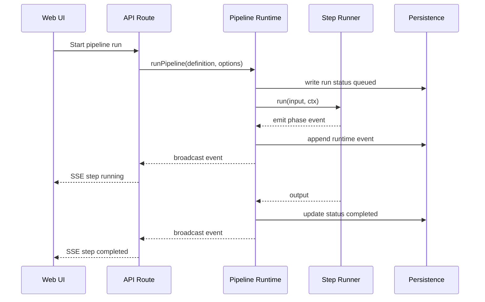

# Inference Pipeline Architecture Refactor Plan

## 0. Goal

현재 목표는 거대한 graph engine을 만드는 것이 아니다.

우리가 필요한 것은 screen inference 과정을 실험하기 쉬운 `Pipeline Step Runner`로 정리하는 것이다.

필요한 기능:

1. 단계의 순서를 자유롭게 변경한다.
2. 각 단계별로 참고 자료, 출력 형식, AI 사용 유무를 선언한다.
3. 특정 단계 결과에 따라 feedback loop를 탄다.
4. Web UI에서 실행 상태를 확인할 수 있도록 persistence layer를 둔다.

이 문서의 공개 설계 용어는 아래 네 가지를 기준으로 한다.

```text
Pipeline Definition = 어떤 Step을 어떤 순서로 실행할지 선언한 실행 계획
Step = 하나의 실행 단계
Step Input = 해당 Step이 참고할 자료
Output Contract = 해당 Step이 반드시 반환해야 하는 결과 형식
```

내부 구현에서 ComfyUI/Blueprint처럼 node나 graph라는 말을 쓸 수는 있다.
하지만 사용자가 조정하는 표면은 `steps`, `inputs`, `output`, `usesAI`, `feedback`으로 제한한다.

Current migration rule:

```text
Do not reduce or merge AI calls during the first Step migration.
The current smoke-proven inference flow is the baseline.
Step migration must preserve behavior first.
```

현재 세분화된 구조는 우선 그대로 유지한다.

```text
read-source
-> parse-source
-> derive-screen-intent
-> plan-composition
-> derive-decoration-plan
-> select-pattern
-> generate-render-tree
-> validate-render-tree
-> propose-components
-> review-quality
-> revise-render-tree-if-invalid
-> validate-render-tree-after-revision
-> write-artifacts
```

`understand -> compose -> review` 같은 단계 축소는 후속 실험 preset으로만 다룬다.
이 문서의 1차 구현 목표가 아니다.

## 1. Core Model

### 1.1 Pipeline Definition

`PipelineDefinition`은 순서와 배선을 선언한다.
실행은 하지 않는다.

```ts
const screenInferencePipeline = definePipeline({
  id: "screen-inference",
  steps: [
    defineStep({
      id: "read-source",
      usesAI: false,
      execute: readSourceStep,
      inputs: {
        source: from("input.source"),
      },
    }),

    defineStep({
      id: "parse-source",
      usesAI: false,
      execute: parseSourceStep,
      inputs: {
        sourceFile: from("step.read-source"),
      },
    }),

    defineStep({
      id: "derive-screen-intent",
      usesAI: true,
      prompt: SCREEN_INTENT_PROMPT,
      inputs: {
        sourceSpec: from("step.parse-source.sourceSpec"),
      },
      output: SCREEN_INTENT_CONTRACT,
    }),

    defineStep({
      id: "plan-composition",
      usesAI: true,
      prompt: COMPOSITION_PLANNING_PROMPT,
      inputs: {
        sourceSpec: from("step.parse-source.sourceSpec"),
        screenIntent: from("step.derive-screen-intent"),
        layoutCatalogs: from("ref.layoutCatalogs"),
        skillBundles: from("ref.skillBundles"),
      },
      output: COMPOSITION_PLAN_CONTRACT,
    }),

    defineStep({
      id: "derive-decoration-plan",
      usesAI: false,
      execute: deriveDecorationPlanStep,
      inputs: {
        sourceSpec: from("step.parse-source.sourceSpec"),
        compositionPlan: from("step.plan-composition"),
        layoutCatalogs: from("ref.layoutCatalogs"),
      },
    }),

    defineStep({
      id: "select-pattern",
      usesAI: true,
      prompt: PATTERN_SELECTION_PROMPT,
      inputs: {
        sourceSpec: from("step.parse-source.sourceSpec"),
        screenIntent: from("step.derive-screen-intent"),
        compositionPlan: from("step.plan-composition"),
        decorationPlan: from("step.derive-decoration-plan.decorationPlan"),
        layerCandidates: from("step.derive-decoration-plan.layerCandidates"),
        designSkillSelection: from("step.plan-composition.designSkillSelection"),
        designContextBundleRefs: from("step.plan-composition.designContextBundleRefs"),
        designContextBundles: from("ref.designContextBundles"),
      },
      output: PATTERN_SELECTION_CONTRACT,
    }),

    defineStep({
      id: "generate-render-tree",
      usesAI: true,
      prompt: SCREEN_GENERATION_PROMPT,
      inputs: {
        sourceSpec: from("step.parse-source.sourceSpec"),
        screenIntent: from("step.derive-screen-intent"),
        compositionPlan: from("step.plan-composition"),
        decorationPlan: from("step.derive-decoration-plan.decorationPlan"),
        patternSelection: from("step.select-pattern"),
        layerCandidates: from("step.derive-decoration-plan.layerCandidates"),
        designSkillSelection: from("step.plan-composition.designSkillSelection"),
        designContextBundleRefs: from("step.plan-composition.designContextBundleRefs"),
        designContextBundles: from("ref.designContextBundles"),
        componentCatalogs: from("ref.componentCatalogs"),
        skillBundles: from("ref.skillBundles"),
      },
      output: SCREEN_GENERATION_CONTRACT,
    }),

    defineStep({
      id: "validate-render-tree",
      usesAI: false,
      execute: validateGenerationStep,
      inputs: {
        target: from("step.generate-render-tree"),
        schema: value(SCREEN_GENERATION_CONTRACT),
        sourceSpec: from("step.parse-source.sourceSpec"),
        screenIntent: from("step.derive-screen-intent"),
        compositionPlan: from("step.plan-composition"),
        decorationPlan: from("step.derive-decoration-plan.decorationPlan"),
        layerCandidates: from("step.derive-decoration-plan.layerCandidates"),
      },
      output: VALIDATION_RESULT_CONTRACT,
    }),

    defineStep({
      id: "propose-components",
      usesAI: true,
      prompt: COMPONENT_PROPOSAL_PROMPT,
      inputs: {
        sourceSpec: from("step.parse-source.sourceSpec"),
        candidate: from("step.generate-render-tree"),
        screenIntent: from("step.derive-screen-intent"),
        compositionPlan: from("step.plan-composition"),
        decorationPlan: from("step.derive-decoration-plan.decorationPlan"),
        patternSelection: from("step.select-pattern"),
        layerCandidates: from("step.derive-decoration-plan.layerCandidates"),
        designSkillSelection: from("step.plan-composition.designSkillSelection"),
        designContextBundleRefs: from("step.plan-composition.designContextBundleRefs"),
        designContextBundles: from("ref.designContextBundles"),
        componentCatalogs: from("ref.componentCatalogs"),
      },
      output: COMPONENT_PROPOSAL_CONTRACT,
    }),

    defineStep({
      id: "review-quality",
      usesAI: true,
      prompt: QUALITY_REVIEW_PROMPT,
      inputs: {
        sourceSpec: from("step.parse-source.sourceSpec"),
        candidate: from("step.generate-render-tree"),
        screenIntent: from("step.derive-screen-intent"),
        compositionPlan: from("step.plan-composition"),
        decorationPlan: from("step.derive-decoration-plan.decorationPlan"),
        patternSelection: from("step.select-pattern"),
        layerCandidates: from("step.derive-decoration-plan.layerCandidates"),
        designSkillSelection: from("step.plan-composition.designSkillSelection"),
        designContextBundleRefs: from("step.plan-composition.designContextBundleRefs"),
        designContextBundles: from("ref.designContextBundles"),
        validationReport: from("step.validate-render-tree"),
        componentProposal: from("step.propose-components"),
        componentCatalogs: from("ref.componentCatalogs"),
      },
      output: QUALITY_REVIEW_CONTRACT,
    }),

    defineStep({
      id: "revise-render-tree-if-invalid",
      usesAI: true,
      prompt: SCREEN_REVISION_PROMPT,
      inputs: {
        sourceSpec: from("step.parse-source.sourceSpec"),
        previousCandidate: from("step.generate-render-tree"),
        screenIntent: from("step.derive-screen-intent"),
        compositionPlan: from("step.plan-composition"),
        decorationPlan: from("step.derive-decoration-plan.decorationPlan"),
        patternSelection: from("step.select-pattern"),
        layerCandidates: from("step.derive-decoration-plan.layerCandidates"),
        designSkillSelection: from("step.plan-composition.designSkillSelection"),
        designContextBundleRefs: from("step.plan-composition.designContextBundleRefs"),
        designContextBundles: from("ref.designContextBundles"),
        validationReport: from("step.validate-render-tree"),
        qualityInspection: from("step.review-quality"),
        componentCatalogs: from("ref.componentCatalogs"),
      },
      output: SCREEN_GENERATION_CONTRACT,
    }),

    defineStep({
      id: "validate-render-tree-after-revision",
      usesAI: false,
      execute: validateGenerationStep,
      inputs: {
        target: from("step.revise-render-tree-if-invalid"),
        schema: value(SCREEN_GENERATION_CONTRACT),
        sourceSpec: from("step.parse-source.sourceSpec"),
        screenIntent: from("step.derive-screen-intent"),
        compositionPlan: from("step.plan-composition"),
        decorationPlan: from("step.derive-decoration-plan.decorationPlan"),
        layerCandidates: from("step.derive-decoration-plan.layerCandidates"),
      },
      output: VALIDATION_RESULT_CONTRACT,
    }),

    defineStep({
      id: "write-artifacts",
      usesAI: false,
      execute: writeArtifactsStep,
      inputs: {
        finalCandidate: from("step.revise-render-tree-if-invalid"),
        initialValidation: from("step.validate-render-tree"),
        finalValidation: from("step.validate-render-tree-after-revision"),
        componentProposal: from("step.propose-components"),
        qualityReview: from("step.review-quality"),
      },
    }),
  ],

  artifacts: [
    {
      id: "final-result",
      from: from("step.write-artifacts.finalResult"),
      when: pipelineSucceeded(),
      kind: "render-tree",
    },
    {
      id: "trace",
      from: collectSteps([
        "derive-screen-intent",
        "plan-composition",
        "derive-decoration-plan",
        "select-pattern",
        "generate-render-tree",
        "validate-render-tree",
        "propose-components",
        "review-quality",
        "revise-render-tree-if-invalid",
        "validate-render-tree-after-revision",
      ]),
      kind: "pipeline-trace",
    },
  ],
});
```

위 예시는 현재 `screenGenerationPipelineDefinition.stages`를 보존하는 1차 migration 형태다.
현재 구현에서는 revision loop가 별도 `feedback` rule로 외부화되어 있지 않고,
`revise-render-tree-if-invalid` Step 내부에서 `buildGenerationNextAction(...)` 결과에 따라 no-op 또는 revision을 수행한다.
`feedback` rule은 그 판단을 pipeline runtime으로 끌어올릴 때의 후속 목표 API다.

현재 구현에서 `sourceReferenceCatalog`는 `parse-source`가 별도 public output으로 내보내는 값이 아니라,
각 agent input builder가 `sourceSpec`에서 조립해 context에 포함하는 값이다.
Step API로 옮길 때도 `sourceSpec`을 Step output으로 두고, source refs는 context assembly 내부 파생값으로 취급한다.

이 방식에서 실험자는 아래만 바꾸면 된다.

```text
- steps 배열 순서
- step.inputs
- step.output
- step.usesAI
- step.prompt
- feedback rule
- artifact rule
```

### 1.2 Step

`Step`은 하나의 작업 단위다.
AI를 쓸 수도 있고, 쓰지 않을 수도 있다.

```ts
type PipelineStep = AiPipelineStep | ExecutablePipelineStep;

type BasePipelineStep = {
  id: string;
  inputs: Record<string, StepInputRef>;
};

type AiPipelineStep = BasePipelineStep & {
  usesAI: true;
  prompt: AgentPromptBundle;
  output: OutputContract;
};

type ExecutablePipelineStep = BasePipelineStep & {
  usesAI: false;
  execute: StepExecutor;
  output?: OutputContract;
};
```

AI Step은 다음 값을 반드시 보장한다.

```text
1. prompt
2. inputs
3. output contract schema
```

비 AI Step은 `execute(input, ctx)`로 실행된다.
비 AI Step의 반환 타입은 TypeScript 함수 타입이 기본 계약이다.
UI, feedback, runtime 검증이 필요한 경우에만 `output` contract를 선택적으로 둔다.

예:

```ts
const validateComposeStep: PipelineStep = {
  id: "validate-render-tree",
  usesAI: false,
  execute: validateStep,
  inputs: {
    target: from("step.generate-render-tree"),
    schema: value(SCREEN_GENERATION_CONTRACT),
  },
  output: VALIDATION_RESULT_CONTRACT,
};
```

### 1.3 Step Input

`Step Input`은 해당 단계가 참고할 자료다.

```ts
type StepInputRef =
  | { kind: "ref"; ref: string }
  | { kind: "value"; value: unknown };
```

1차 API:

```ts
from("input.source")
from("step.generate-render-tree")
from("step.plan-composition.sectionOrder")
from("ref.layoutCatalogs")
from("ref.componentCatalogs.Button")
from("ref.skillBundles")
from("ref.designContextBundles")
value(SCREEN_GENERATION_CONTRACT)
```

이전 논의의 `artifactFrom("generate-render-tree.result")`는 공개 API에서는 `from("step.generate-render-tree")`로 정리한다.
이름을 `from` 하나로 둔 이유는 input, step output, 외부 reference가 모두 "어떤 namespace에서 값을 가져오는 reference"라는 같은 모델이기 때문이다.

Input API 정규화:

```text
from(ref)
= runtime state에서 ref path에 해당하는 값을 가져온다.

value(value)
= literal/static value
```

ref namespace:

```text
input.*
= pipeline run 시작 시 들어온 입력 값

step.*
= 이전 Step runtime output

ref.*
= pipeline run 전에 주입한 외부 참조 객체
```

선택적 helper:

```ts
fromStep("generate-render-tree")
fromStep("plan-composition", "sectionOrder")
fromRef("componentCatalogs")
fromRef("componentCatalogs", "Button")
fromRef("skillBundles")
fromRef("designContextBundles")
```

선택적 helper는 내부적으로 `from(ref)`를 반환하는 얇은 wrapper다.
1차 API와 문서 예시는 `from(ref)`를 기준으로 한다.

Helper 구현 예:

```ts
function from(ref: string): StepInputRef {
  return { kind: "ref", ref };
}

function value(value: unknown): StepInputRef {
  return { kind: "value", value };
}

function fromStep(stepId: string, path?: string): StepInputRef {
  return from(path ? `step.${stepId}.${path}` : `step.${stepId}`);
}

function fromRef(key: string, path?: string): StepInputRef {
  return from(path ? `ref.${key}.${path}` : `ref.${key}`);
}
```

예:

```ts
inputs: {
  componentCatalogs: from("ref.componentCatalogs"),
  layoutCatalogs: from("ref.layoutCatalogs"),
  skillBundles: from("ref.skillBundles"),
  designContextBundles: from("ref.designContextBundles"),
}
```

다른 패키지에서 reference bundle을 불러와 주입하는 예:

```ts
import {
  componentCatalog,
  getComponentCatalogEntry,
  getComponentCatalogTypes,
  listCandidateComponentEntries,
} from "@cx/components/catalog";
import { findPattern, listPatterns, loadPatternStore } from "@cx/layout-pattern-store";
import {
  resolveCompositeLayoutByComponentType,
  resolveRegionLayoutFromScreenLayout,
} from "@cx/layout-pattern-store/resolver";

const screenInferenceRefs = {
  componentCatalogs: {
    catalog: componentCatalog,
    getEntry: getComponentCatalogEntry,
    listTypes: getComponentCatalogTypes,
    listCandidates: listCandidateComponentEntries,
  },
  layoutCatalogs: {
    store: loadPatternStore(),
    findPattern,
    listPatterns,
    resolveCompositeLayoutByComponentType,
    resolveRegionLayoutFromScreenLayout,
  },
  designContextBundles,
  skillBundles,
};

await runPipeline(screenInferencePipeline, {
  input: {
    source: sourceInput,
  },
  refs: screenInferenceRefs,
});
```

Step에서는 ref가 어느 패키지에서 왔는지 알지 않는다.
Step은 선언부에서 참조만 한다.

```ts
defineStep({
  id: "generate-render-tree",
  usesAI: true,
  prompt: SCREEN_GENERATION_PROMPT,
  inputs: {
    sourceSpec: from("step.parse-source.sourceSpec"),
    componentCatalogs: from("ref.componentCatalogs"),
    layoutCatalogs: from("ref.layoutCatalogs"),
    designContextBundles: from("ref.designContextBundles"),
    skillBundles: from("ref.skillBundles"),
  },
  output: SCREEN_GENERATION_CONTRACT,
});
```

이 구조에서 package 경계:

```text
@cx/components
= componentCatalogs 값을 소유한다.
= stable component catalog, candidate component entries, component lookup helpers를 제공한다.

@cx/layout-pattern-store
= layoutCatalogs 값을 소유한다.
= screen/region/area/composite pattern catalog와 layout resolver helpers를 제공한다.

agent docs / inference reference package
= skillBundles와 designContextBundles 값을 소유한다.

@cx/orchestration 또는 @cx/inference-steps
= 어떤 Step이 어떤 reference를 받을지 선언한다.

@cx/pipeline
= refs를 runtime state에 싣고 from(ref)를 resolve한다.
```

### 1.4 Output Contract

`OutputContract`는 AI Step이 반환해야 하는 결과 형식이다.
비 AI Step에서는 선택 사항이다.
이전 Step의 결과는 여기에 포함하지 않는다.

```ts
type OutputContract = {
  artifactKind: string;
  jsonSchema: unknown;
  schemaVersion: string;
};
```

예:

```ts
const SCREEN_GENERATION_CONTRACT = {
  artifactKind: "screen-generation-result",
  jsonSchema: getJsonSchema("screen-generation-result"),
  schemaVersion: "screen-generation-result.v0.1",
};
```

구분:

```text
이전 결과를 참고하게 하는 것 = step.inputs
이번 AI 결과의 모양을 정하는 것 = step.output
실제로 순서대로 돌리는 것 = pipeline runtime
```

### 1.5 Runtime Step Output

각 Step이 끝나면 runtime output이 생긴다.
모든 runtime output이 파일로 저장되는 것은 아니다.

```text
Step Output = Step이 반환한 실행 결과
Runtime Output = 같은 pipeline run 안에서 다음 Step이 참조할 수 있는 output
Persisted Artifact = storage에 저장된 파일 또는 레코드
```

권장:

```text
모든 Step output은 runtime state에 저장한다.
필요한 output만 persisted artifact로 저장한다.
```

예:

```ts
type PipelineExecutionState = {
  input: Record<string, unknown>;
  refs: Record<string, unknown>;
  retryCounts: Record<string, number>;
  afterStep: Record<string, string | undefined>;
  steps: Record<
    string,
    {
      status: "queued" | "running" | "completed" | "failed" | "skipped";
      output?: unknown;
    }
  >;
};
```

## 2. Responsibility Split

### 2.1 `@cx/pipeline`

`@cx/pipeline`은 pipeline runtime이다.

책임:

- `PipelineDefinition` 실행
- Step 순서 관리
- Step input resolve
- Step output runtime state 저장
- feedback route 적용
- retry count 관리
- run lifecycle 관리
- run status persistence
- event log persistence
- observer/SSE broadcaster 연결
- Step runtime adapter 주입
- failure, skip, retry policy

소유하지 않는 것:

- prompt 내용
- AI context/reference 조립 규칙
- design skill 선택 규칙
- generation next action 판단 규칙
- Step별 business logic
- Claude runner 구현
- validation rule 구현

### 2.2 `@cx/inference-nodes`

`@cx/orchestration`을 `@cx/inference-nodes`로 rename하는 방향을 검토한다.

`@cx/inference-nodes`는 pipeline에서 실행할 Step 구현과 preset helper를 제공한다.
공개 사용자는 node라는 용어보다 Step으로 소비한다.

책임:

- Step runner 구현
- agent prompt Step wrapper
- context/reference assembly helper
- deterministic decision helper
- design context selection
- design skill selection
- validation Step wrapper
- decision Step wrapper
- file I/O Step wrapper
- prompt bundle 소유
- screen-generation Step preset 구성

소유하지 않는 것:

- Step scheduling
- feedback route 실제 실행
- run status persistence 구현
- SSE/WebSocket transport
- concrete filesystem 직접 접근
- concrete Claude runner 구현

### 2.3 `@cx/agent`

책임:

- Claude SDK/CLI runner
- fake runner
- result parsing
- session policy
- generic prompt execution

`@cx/agent`는 task별 prompt 지식을 소유하지 않는다.
`@cx/agent`는 `@cx/inference-nodes`가 제공한 prompt bundle을 실행하는 runtime이다.

`@cx/inference-nodes`는 concrete `@cx/agent` 구현을 직접 import하지 않는다.
Pipeline이 주입한 `ctx.agent` adapter를 통해 실행한다.

### 2.4 `@cx/validation`

책임:

- schema validation
- semantic validation
- proposal validation
- table generation result validation

Validation Step은 `ctx.validation` adapter를 통해 검증을 실행한다.

## 3. Runtime Shape

### 3.1 Pipeline Executor

실제 실행은 pipeline runtime이 한다.

```ts
async function runPipeline(definition: PipelineDefinition, options: PipelineRunOptions) {
  const state = createInitialExecutionState(definition, options);
  const ctx = createStepRunContext(options);

  let cursor = 0;

  while (cursor < definition.steps.length) {
    const step = definition.steps[cursor];
    const input = resolveStepInputs(step.inputs, state);

    await recordStepEvent(state, step.id, "running");

    try {
      const output = step.usesAI
        ? await runAgentPromptStep(step, input, ctx)
        : await step.execute(input, ctx);

      applyStepOutput(state, step.id, output);
      await recordStepEvent(state, step.id, "completed");

      const route = evaluateFeedback(definition.feedback, step.id, output, state);
      if (route) {
        state.retryCounts[route.id] = (state.retryCounts[route.id] ?? 0) + 1;
        state.afterStep[route.goTo] = route.then;
        cursor = findStepIndex(definition.steps, route.goTo);
        continue;
      }

      const nextStepId = state.afterStep[step.id];
      if (nextStepId) {
        delete state.afterStep[step.id];
        cursor = findStepIndex(definition.steps, nextStepId);
        continue;
      }

      cursor += 1;
    } catch (error) {
      await recordStepEvent(state, step.id, "failed", error);
      throw error;
    }
  }

  await persistArtifacts(definition.artifacts, state);
  await completeRunStatus(state);
  return createPipelineResult(state);
}
```

Pipeline runtime은 아래를 보장한다.

```text
- Step 실행 전 input ref를 resolve한다.
- missing ref는 pipeline error로 처리한다.
- Step output을 runtime state에 저장한다.
- Step status와 event를 persistence에 기록한다.
- feedback route를 적용한다.
- Step은 다음 Step 존재 여부를 모른다.
```

Input resolve 예:

```ts
function resolveStepInputs(
  inputs: Record<string, StepInputRef>,
  state: PipelineExecutionState,
) {
  return Object.fromEntries(
    Object.entries(inputs).map(([key, ref]) => [key, resolveInputRef(ref, state)]),
  );
}

function resolveInputRef(ref: StepInputRef, state: PipelineExecutionState) {
  if (ref.kind === "value") return ref.value;

  const [namespace, key, ...path] = ref.ref.split(".");

  if (namespace === "input") {
    return readPath(state.input[key], path);
  }

  if (namespace === "step") {
    const output = state.steps[key]?.output;
    if (output === undefined) {
      throw new Error(`Step output is not ready: ${key}`);
    }
    return readPath(output, path);
  }

  if (namespace === "ref") {
    return readPath(state.refs[key], path);
  }

  throw new Error(`Unknown input ref namespace: ${namespace}`);
}
```

Feedback route 예:

```ts
function evaluateFeedback(
  rules: PipelineFeedbackRule[] | undefined,
  stepId: string,
  output: unknown,
  state: PipelineExecutionState,
) {
  for (const rule of rules ?? []) {
    if (rule.fromStep !== stepId) continue;
    if ((state.retryCounts[rule.id] ?? 0) >= rule.maxRetries) continue;
    if (rule.when(output, state)) return rule;
  }
  return undefined;
}
```

### 3.2 Step Run Context

```ts
type StepRunContext = {
  emit: (event: PipelineRuntimeEvent) => Promise<void> | void;
  io: PipelineIOAdapter;
  agent: AgentPromptRuntimeAdapter;
  validation: ValidationAdapter;
  clock: PipelineClockAdapter;
};
```

### 3.3 Agent Step

AI Step은 `prompt + resolved input + output`을 agent runtime에 전달한다.

```ts
type AgentPromptBundle = {
  id: string;
  version: string;
  system: string;
  instruction: string;
  responseMode: "json";
};
```

```ts
type AgentPromptRuntimeAdapter = {
  runPrompt(input: {
    prompt: AgentPromptBundle;
    input: Record<string, unknown>;
    output: OutputContract;
  }): Promise<unknown>;
};
```

예:

```ts
const screenGenerationStep: PipelineStep = {
  id: "generate-render-tree",
  usesAI: true,
  prompt: SCREEN_GENERATION_PROMPT,
  inputs: {
    sourceSpec: from("step.parse-source.sourceSpec"),
    screenIntent: from("step.derive-screen-intent"),
    compositionPlan: from("step.plan-composition"),
    patternSelection: from("step.select-pattern"),
    componentCatalogs: from("ref.componentCatalogs"),
  },
  output: SCREEN_GENERATION_CONTRACT,
};
```

기존 `taskKind`는 agent Step API의 필수 개념으로 두지 않는다.
Migration 기간 동안 internal compatibility layer로만 유지한다.

### 3.4 Context Assembly

Context assembly는 agent 실행 안에 숨기지 않는다.
다만 공개 API에서는 별도 graph node보다 Step input 조립으로 표현한다.

권장:

```ts
const generationContext = buildAgentContext({
  files,
  parts: [
    sourceReferenceCatalog(sourceSpec),
    sourceSummary(sourceSpec),
    stepOutput("screenIntent", screenIntent),
    stepOutput("compositionPlan", compositionPlan),
    stepOutput("patternSelection", patternSelection),
    designContextBundles(bundles),
    componentContractCatalog(catalog),
    layerCandidates(candidates),
  ],
});
```

Pipeline Definition에서는 이렇게 보인다.

```ts
{
  id: "generate-render-tree",
  usesAI: true,
  prompt: SCREEN_GENERATION_PROMPT,
  inputs: {
    sourceSpec: from("step.parse-source.sourceSpec"),
    screenIntent: from("step.derive-screen-intent"),
    compositionPlan: from("step.plan-composition"),
    decorationPlan: from("step.derive-decoration-plan.decorationPlan"),
    patternSelection: from("step.select-pattern"),
    componentCatalogs: from("ref.componentCatalogs"),
    layerCandidates: from("step.derive-decoration-plan.layerCandidates"),
    designContextBundles: from("ref.designContextBundles"),
    skillBundles: from("ref.skillBundles"),
  },
  output: SCREEN_GENERATION_CONTRACT,
}
```

`buildAgentContext` 책임:

```text
- files를 agent file input으로 normalize한다.
- parts를 순서대로 merge한다.
- duplicate key를 검사한다.
- undefined/null part를 제거한다.
- trace/debug metadata를 추가한다.
- prompt 실행, output contract, persistence는 모른다.
```

비추천:

```ts
buildAgentContext({
  kind: "generate",
  files,
});
```

이유:

```text
kind 기반 context builder는 내부 switch/if-chain이 커질 위험이 있다.
Step input 기반 assembly는 어떤 reference가 들어가는지 선언부에서 보인다.
```

## 4. Feedback Route

### 4.1 Validation Step

Validation Step은 검증 사실만 반환한다.
실패했다고 해서 validation Step 안에서 되돌아가지 않는다.

```ts
runValidateStep({
  target,
  schema,
  semanticRules,
});
```

Validation Step 책임:

```text
- target 검증
- schema/semantic issue 반환
- ok/error/warning summary 반환
- retry 정책 모름
- feedback route 모름
- persistence 모름
```

### 4.2 Decision Step

Decision Step은 validation, review, retry count 같은 사실을 받아 next action을 추천한다.

```ts
runDecisionStep({
  facts: {
    validation,
    review,
    retryCount,
  },
  policy,
});
```

Decision Step 책임:

```text
- next action 추천
- reason 반환
- target step 또는 terminal state 반환
- 직접 goto하지 않음
- persistence 모름
```

Pipeline 책임:

```text
- decision을 실제 feedback route로 적용
- retry count 증가
- step order/goto 수행
- status persistence 갱신
```

핵심 원칙:

```text
Steps produce facts.
Decision Steps recommend next action.
Pipeline decides and executes flow.
```

### 4.3 Feedback Rule

```ts
type PipelineFeedbackRule = {
  id: string;
  fromStep: string;
  when: FeedbackCondition;
  goTo: string;
  then?: string;
  maxRetries: number;
};

type FeedbackCondition = (
  output: unknown,
  state: PipelineExecutionState,
) => boolean;
```

필드 의미:

```text
fromStep = feedback 조건을 평가할 Step
when = feedback 발동 조건
goTo = feedback이 발동했을 때 먼저 실행할 Step
then = goTo Step이 끝난 뒤 다시 이어갈 Step
maxRetries = feedback이 계속 발동할 때 무한 루프를 막는 상한
```

`then`은 optional revision Step을 feedback rule로 외부화할 때 재진입 위치를 명확하게 하기 위해 필요하다.
현재 구현은 `revise-render-tree-if-invalid` ordered Step 내부에서 no-op 또는 revision을 수행한다.
후속 목표 API에서 revision을 optional feedback Step으로 빼면, revision이 끝난 뒤 `validate-render-tree`부터 다시 돌도록 `then`을 둔다.

`maxRetries`는 `review-quality`가 계속 revise를 요청할 때 무한 루프를 막는 안전장치다.
`then`은 재진입 위치를 정의하고, `maxRetries`는 반복 횟수를 제한한다.

예:

```ts
feedback: [
  {
    id: "quality-revision",
    fromStep: "review-quality",
    when: reviewDecisionIs("revise"),
    goTo: "revise-render-tree-if-invalid",
    then: "validate-render-tree",
    maxRetries: 2,
  },
];
```

실행 예:

```text
generate-render-tree
-> validate-render-tree
-> review-quality
-> feedback says revise
-> pipeline increments retryCount
-> pipeline goes to revise-render-tree-if-invalid
-> validate-render-tree
-> review-quality
```

### 4.4 Artifact Rule

`artifacts`는 pipeline 완료 시 저장할 산출물과 trace를 선언한다.
각 Step이 직접 persistence를 호출하지 않고, pipeline runtime이 artifact rule을 평가한다.

```ts
type PipelineArtifactRule = {
  id: string;
  from: StepInputRef | StepCollectionRef;
  when?: ArtifactCondition;
  kind: string;
};

type StepCollectionRef = {
  kind: "step-collection";
  stepIds: string[];
};

type ArtifactCondition = (state: PipelineExecutionState) => boolean;
```

예:

```ts
artifacts: [
  {
    id: "final-result",
    from: from("step.write-artifacts.finalResult"),
    when: pipelineSucceeded(),
    kind: "render-tree",
  },
  {
    id: "trace",
    from: collectSteps([
      "derive-screen-intent",
      "plan-composition",
      "derive-decoration-plan",
      "select-pattern",
      "generate-render-tree",
      "validate-render-tree",
      "propose-components",
      "review-quality",
      "revise-render-tree-if-invalid",
      "validate-render-tree-after-revision",
    ]),
    kind: "pipeline-trace",
  },
];
```

## 5. Target Pipeline APIs

### 5.1 Current Important APIs

```ts
runPipeline(pipeline, options)
buildPipeline(definition)
createNodePipelineAdapters()
runSideEffects(input)
runParseMarkdownSourceCommand(input)
```

Persistence APIs already introduced:

```ts
createFilePipelinePersistenceAdapter(input)
createPipelineRunStatus(input)
updatePipelineRunStatus(input)
completePipelineRunStatus(status, timestamp)
createPipelineRunEvent(input)
persistPipelineRunEvent(input)
```

### 5.2 Target API

```ts
definePipeline(definition)
runPipeline(definition, options)
from(ref)
value(value)
```

```ts
type PipelineRunOptions = {
  input: PipelineRunInput;
  refs?: PipelineRuntimeRefs;
  runtime?: PipelineRuntimeOptions;
  storage?: PipelineStorageOptions;
  observers?: PipelineObserverOptions;
};
```

```ts
type PipelineRuntimeRefs = Record<string, unknown>;
```

```ts
type PipelineRunInput = {
  source: PipelineSourceInput;
  runId?: string;
  tags?: string[];
};
```

```ts
type PipelineRuntimeOptions = {
  agent?: {
    mode?: "claude-local-first" | "fake";
  };
};
```

```ts
type PipelineStorageOptions = {
  artifactStore?: {
    preset?: "data-run" | "local-transient" | "web-fixture";
    rootDir?: string;
  };
  persistence?: {
    enabled?: boolean;
    adapter?: PipelinePersistenceAdapter;
    statusFileName?: string;
    eventsFileName?: string;
  };
};
```

```ts
type PipelineObserverOptions = {
  onEvent?: (event: PipelineRuntimeEvent) => Promise<void> | void;
};
```

### 5.3 Preset API

실험 단계에서는 preset을 여러 개 둘 수 있다.

```ts
createScreenGenerationPipelinePreset({
  mode: "current-smoke",
  feedback: "quality-revision",
  context: {
    includePatternCandidates: true,
    includeDesignBundles: true,
    includeComponentCatalog: true,
  },
});
```

Preset은 결국 `PipelineDefinition`을 반환한다.

```ts
const definition = createScreenGenerationPipelinePreset(options);
await runPipeline(definition, runOptions);
```

## 6. Target Step Catalog APIs

기존 `@cx/orchestration` API를 기반으로 한다.

### 6.1 Current Builder APIs

```ts
buildScreenIntentAgentInput(sourceSpec)
buildCompositionPlanAgentInput(input)
buildPatternSelectionAgentInput(input)
buildScreenGenerationAgentInput(sourceSpec, options)
buildQualityReviewAgentInput(input)
buildScreenRevisionAgentInput(input)
buildComponentProposalAgentInput(input)
```

These builders are migration targets.
The target design wraps the current smoke-proven builders as Step definitions first.
It does not merge task-specific builders during the first migration.

### 6.2 Target Prompt Bundles

```ts
SCREEN_INTENT_PROMPT
COMPOSITION_PLANNING_PROMPT
PATTERN_SELECTION_PROMPT
SCREEN_GENERATION_PROMPT
COMPONENT_PROPOSAL_PROMPT
QUALITY_REVIEW_PROMPT
SCREEN_REVISION_PROMPT
```

Prompt ownership:

```text
@cx/inference-nodes owns prompt bundles.
@cx/agent owns generic prompt execution only.
```

### 6.3 Target Step Runners

Agent Step runner:

```ts
runAgentPromptStep({
  prompt,
  input,
  output,
});
```

Validation Step runner:

```ts
runValidateStep({
  target,
  schema,
  semanticRules,
});
```

Decision Step runner:

```ts
runDecisionStep({
  facts,
  policy,
});
```

I/O Step runners:

```text
readSourceStep
writeArtifactsStep
loadDesignContextBundlesStep
loadComponentCatalogStep
```

Deterministic Step runners:

```text
buildAgentContextStep
decorationPlanNormalizeStep
designContextSelectionStep
designSkillSelectionStep
patternLayerCandidatesStep
sourceReferenceCatalogStep
```

Core rule:

```text
Many Step definitions, few Step runner implementations.
```

예:

```ts
const screenGenerationStep = createAgentPromptStep({
  id: "generate-render-tree",
  prompt: SCREEN_GENERATION_PROMPT,
  output: SCREEN_GENERATION_CONTRACT,
});
```

## 7. Current Step Output Contracts

### 7.1 Screen Intent

```ts
type ScreenIntentResult = {
  screenIntent: unknown;
};
```

Role:

```text
- SourceSpec를 해석한다.
- 화면 목적, 주요 action, content priority를 도출한다.
```

### 7.2 Composition Planning

```ts
type CompositionPlanningResult = {
  compositionPlan: unknown;
  decorationPlan?: unknown;
};
```

Role:

```text
- Screen intent를 기준으로 section/composition 계획을 만든다.
- decoration/title/split/divider intent를 만든다.
```

### 7.3 Pattern Selection

```ts
type PatternSelectionResult = {
  patternPlan: unknown;
  layerCandidates?: unknown;
};
```

Role:

```text
- composition plan과 layout catalog를 기준으로 pattern 후보를 선택한다.
- screen-generation Step이 참고할 layout/layer 후보를 정리한다.
```

### 7.4 Screen Generation

```ts
type ScreenGenerationResult = {
  renderTree: unknown;
  tableGenerationResult: unknown;
};
```

Role:

```text
- screen intent, composition plan, pattern selection을 기준으로 RenderTree를 조립한다.
- tableGenerationResult를 함께 만든다.
```

### 7.5 Component Proposal

```ts
type ComponentProposalResult = {
  componentProposal: unknown;
};
```

Role:

```text
- 생성 결과를 기준으로 필요한 component proposal을 비파괴 후보로 만든다.
```

### 7.6 Quality Review

```ts
type QualityReviewResult = {
  qualityReview: unknown;
  revisionDecision: unknown;
  findings: unknown[];
};
```

Role:

```text
- validation facts와 screen generation output을 검토한다.
- source fidelity, hierarchy, separation, action clarity, density, pattern fit을 평가한다.
- feedback policy가 사용할 revision recommendation을 만든다.
```

### 7.7 Future Experiment

아래 축소 모델은 1차 migration 목표가 아니다.

```text
understand -> compose -> review
```

현재 흐름을 Step Definition으로 감싼 뒤, smoke 결과를 비교하면서 별도 preset으로 실험한다.

## 8. Validation Scope

Validate Step은 hard gate만 검증한다.
Review Step이 품질, 의도, 미묘한 일관성 판단을 담당한다.

Validate Step에 남길 검증:

```text
1. Schema Contract
2. Source Ref
3. Layout / Pattern
4. Component Catalog
```

Review Step으로 넘길 검토:

```text
1. Previous Result Consistency
2. State Coverage
3. Design Rule / Quality
4. TableGenerationResult와 RenderTree의 깊은 일관성
5. Source fidelity
6. Action clarity / hierarchy / density / pattern fit
```

역할:

```text
ValidateStep = machine-checkable contract gate
ReviewStep = design/source/quality judgement
DecisionStep = route recommendation
Pipeline = actual route execution
```

## 9. Persistence And SSE Plan

### 9.1 Run Storage And File I/O

현재 Web MVP는 run별 파일 디렉터리를 기준으로 screen inference 상태와 산출물을 저장한다.

```text
data/runs/screen-generation/<runId>/
  status.json
  manifest.json
  pipeline-status.json
  pipeline-events.ndjson
  artifacts/
    source-spec.json
    screen-intent.json
    composition-plan.json
    decoration-plan.json
    pattern-selection.json
    agent-result.json
    validation-report.json
    component-proposal.json
    quality-review.json
    final-result.json
    pipeline-result.json
```

역할 구분:

```text
status.json
= Web screen inference lifecycle read model
= queued/running/waiting-review/applying/applied/failed 같은 제품 상태

pipeline-status.json
= pipeline runtime status snapshot
= current step/stage, retry count, progress 같은 실행 상태

pipeline-events.ndjson
= pipeline runtime event log
= SSE/replay/debug의 source

artifacts/*.json
= Step 결과 또는 최종 산출물
= Web preview/apply가 읽는 대상
```

File I/O 책임:

```text
Web route/store
- run 생성 요청 검증
- runId 생성
- status.json 작성
- artifact 읽기 endpoint 제공
- apply endpoint 제공

Pipeline runtime
- source read
- step 실행
- pipeline-status.json 작성
- pipeline-events.ndjson append
- artifact rule 실행

Step
- 직접 파일 경로를 조립하지 않는다.
- I/O가 필요하면 ctx.io adapter를 사용한다.

Persistence adapter
- status snapshot write/read
- event log append/read
```

현재 Web run 생성 예:

```ts
export async function POST(request: Request) {
  const body = await request.json();
  if (!body.source?.path) {
    return Response.json({ error: "source.path is required." }, { status: 400 });
  }

  const run = await createScreenInferenceRun({
    previousRunId: body.previousRunId,
    runId: body.runId,
    screenId: body.screenId,
    sourcePath: body.source.path,
    tags: body.tags,
    useAI: body.useAI,
  });

  return Response.json(run, { status: 202 });
}
```

현재 Web run store 예:

```ts
async function createScreenInferenceRun(input: ScreenInferenceRunCreateInput) {
  const runId = input.runId ?? createScreenInferenceRunId(screenId);
  const status = createScreenInferenceStatus({ runId, status: "queued" });

  await writeRunStatus(status);

  void runScreenInferencePipeline({
    runId,
    sourcePath,
    tags: input.tags,
    useAI: input.useAI,
  });

  return {
    runId,
    status,
    statusUrl: `/api/screen-inference/runs/${encodeURIComponent(runId)}`,
  };
}
```

현재 `status.json` progress update 예:

```ts
await runPipeline("screen-generation", {
  runId,
  source: {
    path: sourcePath,
    type: "file",
  },
  onProgress: async (event) => {
    if (event.status !== "started") return;

    await writeRunStatus(
      createScreenInferenceProgressStatus({
        runId,
        stage: event.stage,
      }),
    );
  },
});
```

목표 구조에서는 `onProgress` polling 전용 update가 `PipelineRuntimeEvent` + SSE로 대체될 수 있다.
단, initial page load와 reconnect fallback을 위해 `status.json` 또는 `pipeline-status.json` snapshot은 계속 필요하다.

### 9.2 Web Client Endpoints

현재 endpoint:

| Method | Endpoint | 역할 | 응답/소비 |
|---|---|---|---|
| `POST` | `/api/screen-inference/runs` | run 생성, background pipeline 시작 | `runId`, `status`, `statusUrl` |
| `GET` | `/api/screen-inference/runs/:runId` | run status/manifest 조회 | `status.json`, `manifest.json` |
| `GET` | `/api/screen-inference/runs/:runId/artifacts/:artifactName` | 허용된 artifact JSON 조회 | preview/review panel |
| `POST` | `/api/screen-inference/runs/:runId/apply` | `final-result.json`을 DB/read model에 적용 | apply result |

목표 endpoint:

| Method | Endpoint | 역할 | 비고 |
|---|---|---|---|
| `GET` | `/api/screen-inference/runs/:runId/events` | SSE event stream | `pipeline-events.ndjson` + broadcaster |
| `GET` | `/api/screen-inference/runs/:runId/pipeline-status` | pipeline runtime snapshot 조회 | 필요 시 debug UI |

Artifact endpoint 예:

```ts
const ALLOWED_ARTIFACTS = new Set([
  "agent-result.json",
  "final-result.json",
  "pipeline-result.json",
  "quality-review.json",
  "validation-report.json",
]);

export async function GET(_request: Request, context: ArtifactRouteContext) {
  const { artifactName, runId } = await context.params;
  if (!ALLOWED_ARTIFACTS.has(artifactName)) {
    return Response.json({ error: "Artifact is not allowed." }, { status: 403 });
  }

  const artifactPath = path.join(readRunDir(runId), "artifacts", artifactName);
  return Response.json(JSON.parse(await readFile(artifactPath, "utf8")));
}
```

Apply endpoint 예:

```ts
export async function POST(_request: Request, context: ApplyRouteContext) {
  const { runId } = await context.params;

  await updateScreenInferenceRunStatus(runId, "applying");

  const finalResult = JSON.parse(
    await readFile(path.join(readRunDir(runId), "artifacts/final-result.json"), "utf8"),
  );

  const result = await applyScreenInferenceFinalResult({ node: finalResult });

  if (!result.written) {
    return Response.json({ ok: false, result }, { status: 422 });
  }

  await updateScreenInferenceRunStatus(runId, "applied");

  return Response.json({ ok: true, result });
}
```

### 9.3 Persistence Adapter

Pipeline persistence adapter는 Web run store와 분리한다.
Web run store는 제품 상태를 쓰고, pipeline persistence는 실행 상태를 쓴다.

```ts
type PipelinePersistenceAdapter = {
  appendEvent(event: PipelineRuntimeEvent): Promise<void>;
  readStatus(runId: string): Promise<PipelineRunStatus | undefined>;
  writeStatus(status: PipelineRunStatus): Promise<void>;
};
```

파일 기반 adapter 예:

```ts
function createFilePipelinePersistenceAdapter(input: {
  fs: PipelineFileSystemAdapter;
  runDir: string;
}) {
  const statusPath = path.join(input.runDir, "pipeline-status.json");
  const eventsPath = path.join(input.runDir, "pipeline-events.ndjson");

  return {
    async writeStatus(status) {
      await input.fs.writeText(statusPath, `${JSON.stringify(status, null, 2)}\n`);
    },

    async readStatus() {
      if (!(await input.fs.exists(statusPath))) return undefined;
      return JSON.parse(await input.fs.readText(statusPath));
    },

    async appendEvent(event) {
      await input.fs.appendText(eventsPath, `${JSON.stringify(event)}\n`);
    },
  };
}
```

주의:

```text
status.json과 pipeline-status.json은 합치지 않는다.

status.json
= Web product lifecycle 상태

pipeline-status.json
= pipeline runtime 상태
```

### 9.4 Event Flow



### 9.5 SSE Route

```http
GET /api/screen-inference/runs/:runId/events
```

Responsibilities:

```text
- load current status snapshot
- stream pipeline events
- stream step events
- stream artifact events
- close when pipeline reaches terminal status
```

Run start API 예:

```ts
export async function POST(request: Request) {
  const body = await request.json();
  const runId = createRunId();

  void runPipeline(screenInferencePipeline, {
    input: {
      runId,
      source: body.source,
    },
    storage: {
      persistence: { enabled: true },
    },
    observers: {
      onEvent(event) {
        pipelineEventBroadcaster.publish(runId, event);
      },
    },
  });

  return Response.json({ runId });
}
```

SSE route 예:

```ts
export async function GET(
  _request: Request,
  { params }: { params: { runId: string } },
) {
  const { runId } = params;

  const stream = new ReadableStream({
    async start(controller) {
      const send = (message: PipelineSseMessage) => {
        controller.enqueue(encodeSse(message.event, message.data));
      };

      const status = await persistence.readStatus(runId);
      if (status) {
        send({ event: "status", data: status });
      }

      const unsubscribe = pipelineEventBroadcaster.subscribe(runId, (event) => {
        send({ event: event.type === "artifact" ? "artifact" : "step", data: event });

        if (event.type === "pipeline" && isTerminalStatus(event.status)) {
          send({ event: "done", data: { runId, status: event.status } });
          unsubscribe();
          controller.close();
        }
      });
    },
  });

  return new Response(stream, {
    headers: {
      "Content-Type": "text/event-stream",
      "Cache-Control": "no-cache, no-transform",
      Connection: "keep-alive",
    },
  });
}

function encodeSse(event: string, data: unknown) {
  return `event: ${event}\ndata: ${JSON.stringify(data)}\n\n`;
}
```

Web client 예:

```ts
async function startScreenInference(source: unknown) {
  const response = await fetch("/api/screen-inference/runs", {
    method: "POST",
    headers: { "Content-Type": "application/json" },
    body: JSON.stringify({ source }),
  });

  const { runId } = await response.json();
  subscribePipelineRun(runId);
}

function subscribePipelineRun(runId: string) {
  const events = new EventSource(`/api/screen-inference/runs/${runId}/events`);

  events.addEventListener("status", (message) => {
    screenInferenceStore.setStatus(JSON.parse(message.data));
  });

  events.addEventListener("step", (message) => {
    screenInferenceStore.applyEvent(JSON.parse(message.data));
  });

  events.addEventListener("artifact", (message) => {
    screenInferenceStore.addArtifact(JSON.parse(message.data));
  });

  events.addEventListener("done", (message) => {
    screenInferenceStore.complete(JSON.parse(message.data));
    events.close();
  });

  events.onerror = () => {
    events.close();
    screenInferenceStore.enablePollingFallback(runId);
  };
}
```

통신 규칙:

```text
POST /api/screen-inference/runs
= pipeline run을 시작하고 runId를 반환한다.

GET /api/screen-inference/runs/:runId/events
= status snapshot을 먼저 보내고 이후 runtime event를 stream한다.

SSE 연결이 끊기면
= Web client는 status polling으로 fallback한다.
```

### 9.6 SSE Event Shape

```ts
type PipelineSseMessage =
  | {
      event: "status";
      data: PipelineRunStatus;
    }
  | {
      event: "step";
      data: PipelineRuntimeEvent;
    }
  | {
      event: "artifact";
      data: PipelineRuntimeEvent;
    }
  | {
      event: "done";
      data: { runId: string; status: "completed" | "failed" | "cancelled" };
    };
```

Example:

```text
event: step
data: {"runId":"web-run-001","stepId":"screen-generation","status":"running","phase":"agent-started"}
```

### 9.7 Why Split Status And Events

`PipelineRunStatus`는 latest snapshot이다.
UI가 "지금 어디까지 왔는가?"를 빠르게 보여주기 위한 read model이다.

`PipelineRuntimeEvent`는 진행 과정을 시간순으로 남기는 append-only log다.
UI가 "어떤 일이 어떤 순서로 일어났는가?"를 재생하거나 stream으로 받기 위한 timeline이다.

둘을 나누는 이유:

```text
Status only:
- latest state 조회는 쉽다.
- phase history, retry history, event replay가 사라진다.

Events only:
- timeline은 완전하다.
- 현재 상태 조회 때마다 replay/reduce가 필요하다.

Status + Events:
- UI initial load는 status를 읽는다.
- UI live update는 events를 구독한다.
- debug/replay는 event log를 사용한다.
```

Rule:

```text
Event log is the timeline.
Status is the latest reduced view.
```

### 9.8 PipelineRunStatus

```ts
type PipelineRunStatus = {
  runId: string;
  pipelineId: string;
  status: "queued" | "running" | "completed" | "failed" | "cancelled";
  startedAt?: string;
  updatedAt: string;
  completedAt?: string;
  currentStepId?: string;
  stepOrder?: string[];
  steps: Record<
    string,
    {
      status: "queued" | "running" | "completed" | "failed" | "skipped";
      startedAt?: string;
      completedAt?: string;
      phase?: string;
      message?: string;
      error?: string;
      retryCount?: number;
    }
  >;
  progress?: {
    completedStepCount?: number;
    totalStepCount?: number;
    percent?: number;
  };
  artifacts?: Record<string, string>;
  error?: string;
};
```

### 9.9 PipelineRuntimeEvent

```ts
type PipelineRuntimeEvent =
  | {
      type: "pipeline";
      runId: string;
      status: "queued" | "running" | "completed" | "failed" | "cancelled";
      phase?: string;
      message?: string;
      timestamp: string;
    }
  | {
      type: "step";
      runId: string;
      stepId: string;
      status: "queued" | "running" | "completed" | "failed" | "skipped";
      phase?: string;
      message?: string;
      timestamp: string;
    }
  | {
      type: "artifact";
      runId: string;
      stepId?: string;
      artifact: {
        key: string;
        path?: string;
        kind?: string;
      };
      timestamp: string;
    };
```

### 9.10 Persistence Adapter

```ts
type PipelinePersistenceAdapter = {
  readStatus(runId: string): Promise<PipelineRunStatus | undefined>;
  writeStatus(status: PipelineRunStatus): Promise<void>;
  appendEvent(event: PipelineRunEvent): Promise<void>;
};
```

File MVP:

```text
<runDir>/pipeline-status.json
<runDir>/pipeline-events.ndjson
```

## 10. Failure And Skip Semantics

아래 실패는 서로 다르다.

```text
agent execution failed
agent output parse failed
validation failed
quality review failed
input ref missing
```

Persistence event와 feedback route에서 구분해야 한다.

Skipped rule:

```text
Pipeline Definition에 선언된 Step이 route decision 때문에 실행되지 않으면 skipped로 기록한다.
Pipeline Definition에 없는 optional feedback Step은 skipped로 기록하지 않는다.
```

## 11. Migration Rollout Plan

Migration success means the new Step API can run the already implemented screen inference flow with the same output quality.
Do not treat a cleaner implementation as successful if it changes prompt inputs, artifact shape, validation coverage, or revision behavior without an explicit quality comparison.

### 11.1 Current Code Evidence

The rollout is based on the current implementation, not only this plan document.

Authoritative code surfaces:

```text
packages/pipeline/src/pipelines/screen-generation/screen-generation-pipeline.ts
= current stage order, stage executor map, state shape, agent calls, validation/revision flow

packages/pipeline/src/pipelines/screen-generation/artifact-commands.ts
= current standalone artifact files, trace shape, manifest layer grouping

packages/pipeline/src/public/types.ts
= current public PipelineStageId, PipelineRunStatus, PipelineRunEvent, persistence adapter types

packages/pipeline/src/__tests__/screen-generation-tags.test.ts
= current stage progress order, manifest layer metadata, status/event persistence expectations

packages/pipeline/src/__tests__/public-api.test.ts
= public API exports, artifact command shape, side-effect boundary expectations
```

Current preserved stage order:

```text
read-source
-> parse-source
-> derive-screen-intent
-> plan-composition
-> derive-decoration-plan
-> select-pattern
-> generate-render-tree
-> validate-render-tree
-> propose-components
-> review-quality
-> revise-render-tree-if-invalid
-> validate-render-tree-after-revision
-> write-artifacts
```

Current preserved artifact/task names:

```text
source-spec.json
screen-intent.json
composition-plan.json
decoration-plan.json
pattern-selection.json
agent-result.json
validation-report.json
quality-review.json
component-proposal.json
final-result.json
pipeline-result.json
trace.json
manifest.json
pipeline-status.json
pipeline-events.ndjson
```

Current quality-critical references:

```text
sourceSpec
screenIntent
compositionPlan
decorationPlan
patternLayerCandidates
designSkillSelection
designContextBundleSelection.bundleRefs
designContextBundleContents
patternSelection
componentContractCatalog
validationReport
qualityInspection
generationNextAction
```

### 11.2 Quality Parity Gates

Every rollout that touches runtime behavior must pass these gates before the next rollout starts.

Static gates:

```text
pnpm exec tsc --noEmit --pretty false --incremental false
pnpm exec vitest run packages/pipeline/src/__tests__/screen-generation-tags.test.ts packages/pipeline/src/__tests__/public-api.test.ts
npm run test:smoke:pipeline
git diff --check
```

Fake-mode parity gate:

```text
npm run test:smoke:pipeline
```

Must preserve:

```text
- progress event started order equals current 13 stages
- pipeline-events.ndjson has started/completed event pairs for every stage
- pipeline-status.json ends as completed with no currentStage
- manifest.stageLayers remains understand/compose/revise
- trace.layers keeps current traceKeys
- final-result.json remains a RenderTree artifact
```

Claude local-first quality gate:

```text
runPipeline("screen-generation", {
  agentMode: "claude-local-first",
  artifactStore: { rootDir },
  runId,
  source: { path: representativeSourcePath, type: "file" },
});
```

Must compare against a baseline run from the current implementation:

```text
- final-result.json validates with the same validation rules
- validation-report.json has no additional error severity issue
- quality-review.json does not downgrade critical scores or request extra revision for the same source
- generated screen preserves source refs and primary user action coverage
- component-proposal.json remains bounded to known source refs and component catalog types
- trace.json proves the same upstream artifacts were available to generation/review/revision
```

Because Claude output is nondeterministic, exact JSON equality is not the quality criterion.
The quality criterion is contract validity, source faithfulness, comparable review outcome, and no lost context input.

Current implementation status:

```text
2026-06-05
- Rollout 0 fake-mode baseline gate is available as `npm run test:smoke:pipeline` and has been run successfully.
- Rollout 0 Claude local-first baseline has been run successfully with `smoke:pipeline -- --use-ai` on `NOVA-PRDD-PG-001-0.md`.
- Rollout 1 Step Definition types/helpers are implemented in `@cx/pipeline/definition`.
- Rollout 2 Step input resolver/state helpers are implemented in `@cx/pipeline/definition`.
- Screen generation runtime still uses the current hardcoded stage loop; no behavior migration has started yet.
```

### 11.3 Rollout 0. Baseline Capture

Goal:

```text
Capture current behavior before Step migration changes runtime code.
```

Tasks:

- Run fake-mode baseline with the current hardcoded stage loop.
- Run at least one Claude local-first baseline on a representative source.
- Store baseline artifact directory under `tmp/` or `data/runs/screen-generation/` with run id that clearly marks it as baseline.
- Record exact command, source path, run id, and validation summary in the rollout notes or `AGENTS_HISTORY.md`.
- Do not change runtime behavior in this rollout.

Done when:

- Fake baseline proves stage order, events, manifest layers, trace shape, and artifact names.
- Claude baseline has valid `final-result.json`, `validation-report.json`, `quality-review.json`, and `component-proposal.json`.
- Later rollouts have concrete artifact directories to compare against.

### 11.4 Rollout 1. Type-Only Step Definition Layer

Goal:

```text
Introduce Step Definition types without changing screen-generation execution.
```

Tasks:

- Add `PipelineStep`, `StepInputRef`, `OutputContractRef`, `definePipeline`, `defineStep`, `from(ref)`, and `value(value)` types/helpers.
- Keep existing `PipelineDefinition.stages` and hardcoded executor path working.
- Add tests that define the current screen inference steps as data but do not execute them.
- Keep `@cx/pipeline` public compatibility intact.

Done when:

- Existing `runPipeline("screen-generation")` behavior is unchanged.
- Type tests can express the current 13-stage order as Step definitions.
- Static and fake-mode parity gates pass.

### 11.5 Rollout 2. Input Resolver And Step State

Goal:

```text
Make Step inputs resolvable from runtime state without moving stage logic yet.
```

Tasks:

- Add runtime state buckets: `input`, `refs`, `steps`, `retryCounts`.
- Implement `resolveStepInputs()` for `input.*`, `step.*`, `ref.*`, and `value(...)`.
- Add missing-ref failure semantics and persisted failed event shape.
- Add resolver tests for nested paths such as `step.derive-decoration-plan.layerCandidates`.
- Keep current screen-generation pipeline on the hardcoded executor map.

Done when:

- Resolver can read all references used by the Step example in section 1.1.
- Missing input ref produces a clear failure distinct from validation or agent failure.
- Static and fake-mode parity gates pass.

### 11.6 Rollout 3. Generic Step Runner Beside Current Runtime

Goal:

```text
Add a generic Step runner that can execute small pipelines, while screen-generation still uses the old path.
```

Tasks:

- Add generic ordered Step runner in `@cx/pipeline`.
- Support executable Step, AI Step adapter interface, status updates, events, and artifact rule evaluation.
- Add tests with a small deterministic pipeline that exercises `from(...)`, `value(...)`, persistence, and skipped/failed semantics.
- Keep `screenGenerationStageExecutors` untouched.

Done when:

- A small `definePipeline({ steps })` fixture executes and persists status/events.
- Pipeline status/event shape remains compatible with current `PipelineRunStatus` and `PipelineRunEvent`.
- Static and fake-mode parity gates pass.

### 11.7 Rollout 4. Wrap Current Stage Executors As Step Executors

Goal:

```text
Run the current 13 screen-generation stages through Step runner without changing stage internals.
```

Tasks:

- Create Step definitions that call the existing stage functions in the same order.
- Preserve existing state keys and artifact write logic.
- Keep the old hardcoded path selectable as a fallback flag during this rollout.
- Ensure `revise-render-tree-if-invalid` preserves current no-op-or-revision behavior.
- Ensure `validate-render-tree-after-revision` still validates the final candidate.

Done when:

- Step-runner path and old path both produce the same artifact file set in fake mode.
- `pipeline-events.ndjson` still has 26 stage events for the 13 stages.
- `manifest.stageLayers` and `trace.layers` are unchanged.
- Static, fake-mode parity, and Claude local-first quality gates pass.

### 11.8 Rollout 5. Extract Inference Nodes

Goal:

```text
Move screen-generation work units out of pipeline without changing their inputs or outputs.
```

Tasks:

- Create `@cx/inference-nodes` package or compatibility subpath.
- Move/wrap pure node units:
  - read/parse source wrappers
  - agent prompt node wrappers
  - decoration plan node
  - validation node
  - component proposal node
  - quality review node
  - revision decision/revision node
  - artifact write node
- Keep actual file access through pipeline-provided I/O.
- Keep actual Claude execution through pipeline-provided agent adapter.
- Keep `@cx/orchestration` exports as compatibility until imports are migrated.

Done when:

- `@cx/pipeline` no longer owns pure stage assembly logic for migrated nodes.
- The node package does not perform persistence or direct file writes.
- Static, fake-mode parity, and Claude local-first quality gates pass.

### 11.9 Rollout 6. External References Injection

Goal:

```text
Replace implicit catalog imports in Step execution with explicit `ref.*` injection where practical.
```

Tasks:

- Inject `componentCatalogs`, `layoutCatalogs`, `skillBundles`, and `designContextBundles` through run options or Step runner context.
- Preserve current public APIs:
  - `@cx/components/catalog`
  - `@cx/layout-pattern-store`
  - `@cx/layout-pattern-store/resolver`
- Keep source refs derived from `sourceSpec` inside context assembly.
- Add tests proving layout/component refs are passed through `refs` and not imported ad hoc by pipeline runtime.

Done when:

- Step definitions show all external references in `inputs`.
- Pipeline runtime does not import component/layout/design-context catalogs directly for migrated nodes.
- Static, fake-mode parity, and Claude local-first quality gates pass.

### 11.10 Rollout 7. Feedback Route Externalization

Goal:

```text
Move revision routing from `revise-render-tree-if-invalid` internals into pipeline feedback rules.
```

Tasks:

- Split decision facts from revision execution if needed.
- Add `PipelineFeedbackRule` support for `fromStep`, `when`, `goTo`, `then`, and `maxRetries`.
- Preserve current `buildGenerationNextAction(...)` policy.
- Ensure no infinite revise loop is possible.
- Preserve revision artifacts and final validation behavior.

Done when:

- Current happy path does not run unnecessary revision.
- Invalid generation path performs decision -> revision -> validation with bounded retry count.
- Persistence records running/completed/skipped/failed statuses accurately.
- Static, fake-mode parity, and Claude local-first quality gates pass.

### 11.11 Rollout 8. SSE Web Delivery

Goal:

```text
Broadcast persisted pipeline events to Web UI without removing status polling fallback.
```

Tasks:

- Add observer/event broadcaster around persisted `PipelineRunEvent`.
- Add Web SSE route that streams run events.
- Add Web `EventSource` consumer.
- Keep current status snapshot endpoint as reconnect/polling fallback.
- Add tests for event serialization and route behavior where practical.

Done when:

- Web can show current stage from SSE events.
- Refresh/reconnect can recover from `pipeline-status.json`.
- Polling fallback still works.
- Static and relevant Web tests pass.

### 11.12 Rollout 9. Cleanup Legacy Stage Loop

Goal:

```text
Remove old hardcoded executor ownership only after Step path proves parity.
```

Tasks:

- Remove or deprecate `screenGenerationStageExecutors`.
- Keep `runPipeline("screen-generation")` public API stable.
- Ensure pipeline owns only definition execution, adapters, persistence, observers, and side effects.
- Ensure inference nodes own actual work units.
- Remove taskKind-first agent builder dependency from public Step surface, keeping taskKind only as internal compatibility if needed.

Done when:

- Pipeline no longer imports individual orchestration builder functions directly.
- Public API still runs `screen-generation`.
- All parity gates pass.
- Migration notes document any intentionally changed artifact or trace shape.

## 12. Open Decisions

### 12.1 Package Name

Recommended:

```text
@cx/inference-nodes
```

Alternatives:

```text
@cx/generation-steps
@cx/inference-steps
@cx/node-catalog
```

### 12.2 I/O Step Ownership

Recommended:

```text
I/O Step wrappers live in inference-nodes.
Actual file access happens through ctx.io provided by pipeline.
```

### 12.3 Agent Runner Step

Recommended:

```text
runAgentPromptStep lives in inference-nodes.
Actual Claude execution happens through ctx.agent.runPrompt provided by pipeline.
Prompt bundles are owned by inference-nodes.
Agent package owns generic prompt runtime only.
```

### 12.4 Persistence

Decision:

```text
Steps never call persistence directly.
Steps emit runtime events.
Pipeline persists and broadcasts events.
```

### 12.5 Validation Feedback Route

Decision:

```text
Validation Step only returns validation facts.
Decision Step recommends next action.
Pipeline executes feedback route and owns retry count/status.
```

### 12.6 Migration Strategy

Recommended:

```text
Add Step layer first.
Run old and new paths side by side.
Move screen-generation to Step preset.
Rename package after Step model stabilizes.
```
