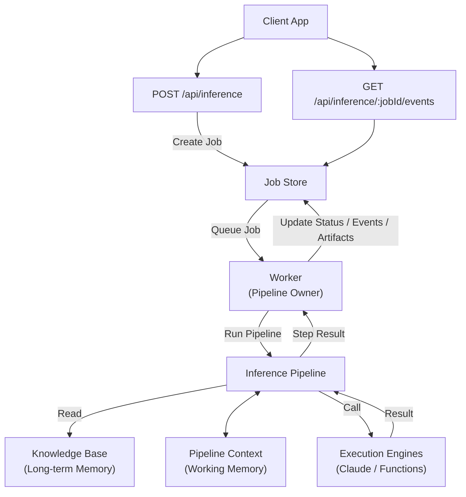

# Screen Inference Architecture

## 1. Document Scope

This document is the SSOT for the new screen inference execution architecture.

It replaces the previous stage/runtime documents:

- `AGENT_RUNTIME_PROTOCOL.md`
- `PIPELINE_STAGE_PROTOCOL.md`
- `PIPELINE_STEP_REFERENCE_MANIFEST_PLAN.md`
- `INFERENCE_SERVICE_STRUCTURE.md`

Package responsibility still follows [PACKAGE_MAP.md](/Users/plusx/Documents/rnd-screen-generator/PACKAGE_MAP.md), and repository layout follows [PROJECT_STRUCTURE.md](/Users/plusx/Documents/rnd-screen-generator/docs/development/PROJECT_STRUCTURE.md). API route surface follows [API_ENDPOINTS.md](/Users/plusx/Documents/rnd-screen-generator/docs/development/API_ENDPOINTS.md).

## 2. Target Architecture



Detailed structure:

```mermaid
flowchart LR

  %% =========================
  %% Client
  %% =========================

  Client["Client App"]

  subgraph API["API Endpoint"]
    POST["POST /api/inference"]
    SSE["GET /api/inference/:jobId/events<br/>GET /api/inference/:jobId/steps"]
  end

  Client -->|useInference()| POST
  Client -->|useInferenceStream()| SSE

  %% =========================
  %% Job Store
  %% =========================

  subgraph JobStore["Job Store"]
    IA["Inference Artifacts"]
    IJ["Inference Jobs"]
    IS["Inference Steps"]
    IE["Screen Inference Events"]
  end

  POST -->|Create Job| JobStore
  SSE -->|SSE Route| JobStore

  %% =========================
  %% Worker
  %% =========================

  Worker["Worker<br/>(Pipeline Owner)"]

  JobStore -->|Queue Job| Worker
  Worker -->|Write Status / Step / Artifact / Event| JobStore

  %% =========================
  %% Pipeline
  %% =========================

  subgraph Pipeline["Inference Pipeline"]

    subgraph Step1["Pipeline Step"]
      S1Schema["Output Contract Schema"]
      S1Prompt["Prompt"]
      S1Refs["References (JSON)"]
    end

    subgraph Step2["Pipeline Step"]
      S2Schema["Output Contract Schema"]
      S2Prompt["Prompt"]
      S2Refs["References (JSON)"]
    end

    subgraph Step3["Pipeline Step"]
      S3Schema["Output Contract Schema"]
      S3Prompt["Prompt"]
      S3Refs["References (JSON)"]
    end

  end

  Worker -->|Run Pipeline| Pipeline
  Pipeline -->|Return Results| Worker

  %% =========================
  %% Knowledge Base
  %% =========================

  subgraph KB["Knowledge Base (Long-term Memory)"]
    Skillset["Skillset"]
    ComponentCatalog["Component Catalog"]
    LayoutCatalog["Layout Catalog"]
    PromptTemplates["Prompt Templates"]
  end

  Pipeline -->|Read| KB

  %% =========================
  %% Pipeline Context
  %% =========================

  subgraph Context["Pipeline Context (Working Memory)"]
    Artifacts1["Created Artifacts"]
    LayoutPlans["Layout Plans"]
    Artifacts2["Created Artifacts"]
    ScreenDatas["Screen Datas"]
  end

  Pipeline <--> |Read / Write| Context

  %% =========================
  %% Execution Engines
  %% =========================

  subgraph Engines["Execution Engines"]
    Claude["API Call<br/>(Claude SDK)"]
    Function["Function"]
  end

  Pipeline -->|Call| Engines
  Engines -->|Return Result| Pipeline
```

The model has five first-class boundaries:

| Boundary | Responsibility |
|---|---|
| API Endpoint | Browser-facing job creation and SSE stream |
| Job Store | Durable jobs, steps, artifacts, events |
| Worker | Owns one pipeline run and writes observable progress |
| Inference Pipeline | Declarative step sequence and step execution contract |
| Execution Engines | Claude SDK/API calls and deterministic functions |

Long-term knowledge is read-only during a run. Working memory is run-local and may be read/written by pipeline steps.

## 3. Package Direction

The current `@cx/inference-nodes` and screen-generation implementation under `@cx/pipeline` are deprecated for new work. They may stay temporarily as compatibility code until Web routes and smoke scripts are migrated.

MVP starts with one new package:

| Package | Responsibility |
|---|---|
| `@cx/inference` | Job/artifact stores, pipeline context, execution engines, pipeline definitions, worker, test fakes |
| `@cx/agent` | Claude Agent SDK local-first execution engine adapter |
| `@cx/schema` | SourceSpec, RenderTree, validation DTO/schema contracts |
| `@cx/validation` | Pure validation reports |
| `@cx/components`, `@cx/layout-pattern-store`, `@cx/tokens` | Knowledge base catalogs and design contracts |

`@cx/inference` internal modules:

```text
packages/inference/src/
  index.ts
  stores/       JobStore, ArtifactStore, FileJobStore, FileArtifactStore, in-memory test fakes
  context/      PipelineContext over ArtifactStore context files
  engine/       Claude/function execution engine adapter boundary
  pipeline/     pipeline and step definition/execution format
  worker/       runInferenceJob and worker orchestration
```

`apps/web` API routes are thin adapters only. They create/read jobs, stream events, and call `@cx/inference` worker entrypoints. They do not own store logic, pipeline execution logic, prompt assembly, or worker state transitions. This keeps the worker testable with an in-memory fake store.

Compatibility packages:

| Package | Status | Rule |
|---|---|---|
| `@cx/inference-nodes` | Deprecated | Do not add new screen inference logic. Move reusable builders into `@cx/inference`. |
| `@cx/pipeline` screen-generation internals | Deprecated for new architecture | Keep existing consumers working during migration. New runtime concepts belong in `@cx/inference`. |

## 4. Local MVP Storage Contract

MVP storage is local file storage, not browser `localStorage`.

Default root:

```text
.data/
  inference-jobs/
    {jobId}/
      job.json
      events.ndjson
      steps/
        01-analyze/
          step.json
          prompt.md
          references.json
          raw-response.json
          output.json
        02-plan-layout/
          step.json
          prompt.md
          references.json
          raw-response.json
          output.json
      context/
        screen-analysis.json
        layout-plan.json
        component-map.json
```

Folder roles:

| Path | Role |
|---|---|
| `job.json` | Current job snapshot |
| `events.ndjson` | Append-only state change log |
| `steps/*/step.json` | Current step snapshot |
| `steps/*/prompt.md` | Prompt sent to an execution engine |
| `steps/*/references.json` | Knowledge/context refs used by the step |
| `steps/*/raw-response.json` | Raw execution engine result |
| `steps/*/output.json` | Normalized step output |
| `context/*.json` | Pipeline working memory read by later steps |

Step folder names may include order prefixes for debuggability. The stable step id is stored in `step.json`; code must not infer step identity only from the folder name.

## 5. Store Interfaces

Store dependency direction:

```text
Worker
  -> JobStore
  -> ContextStore
  -> ArtifactStore
  -> Engine

JobStore
  -> ArtifactStore

ContextStore
  -> ArtifactStore

ArtifactStore
  -> File System

Engine
  independent
```

`ArtifactStore` is the low-level file IO boundary. It owns job root calculation, path normalization/safety, and text/json read/write/append primitives.

`JobStore` and `ContextStore` must use `ArtifactStore` internally instead of touching the file system directly. This keeps path calculation in one place and lets worker tests replace file IO with memory-backed stores.

`Worker` may use `ArtifactStore` directly only for generic step artifacts such as `steps/01-analyze/prompt.md`, `references.json`, `raw-response.json`, and `output.json`. Job state and working memory must go through `JobStore` and `ContextStore`.

`JobStore` owns observable job state, step snapshots, and event logs.

```ts
interface JobStore {
	createJob(input: CreateJobInput): Promise<Job>;
	getJob(jobId: string): Promise<Job>;
	updateJob(jobId: string, patch: Partial<Job>): Promise<void>;

	createStep(jobId: string, stepId: string): Promise<void>;
	updateStep(jobId: string, stepId: string, patch: Partial<Step>): Promise<void>;

	appendEvent(jobId: string, event: InferenceEvent): Promise<void>;
	listEvents(jobId: string, after?: number): Promise<InferenceEvent[]>;
}
```

`ArtifactStore` owns file-like job artifacts.

```ts
interface ArtifactStore {
	writeText(jobId: string, path: string, content: string): Promise<void>;
	writeJson(jobId: string, path: string, value: unknown): Promise<void>;
	readJson<T>(jobId: string, path: string): Promise<T>;
	exists(jobId: string, path: string): Promise<boolean>;
}
```

MVP implementations:

| Interface | File implementation | Test implementation |
|---|---|---|
| `JobStore` | `FileJobStore` | `MemoryJobStore` |
| `ArtifactStore` | `FileArtifactStore` | `MemoryArtifactStore` |

## 6. Event Contract

Every line in `events.ndjson` is one `InferenceEvent`.

Each event must include a monotonic `seq` assigned by `JobStore.appendEvent(...)`.

```ts
type InferenceEvent = {
	seq: number;
	jobId: string;
	type: string;
	timestamp: string;
	stepId?: string;
	payload?: unknown;
};
```

Rules:

- `seq` is monotonic per job.
- `listEvents(jobId, after)` returns events with `seq > after`.
- SSE event id uses the same `seq`.
- API routes and workers must not guess sequence numbers independently; the JobStore assigns them.

## 7. Runtime Flow

```text
Client App
-> POST /api/inference
-> Job Store creates inference job
-> Worker claims queued job
-> Worker runs @cx/inference pipeline
-> Pipeline step reads Knowledge Base references
-> Pipeline step reads/writes Pipeline Context
-> Pipeline step calls an Execution Engine
-> Worker writes step status, artifacts, and events to Job Store
-> Client receives progress through SSE and reads snapshots/artifacts through API
```

The worker is the pipeline owner. API routes do not run the pipeline inline except for local development fixtures explicitly marked as dev-only.

## 8. Pipeline Context

Pipeline Context is a typed facade over `ArtifactStore` paths under `context/`.

It should provide stable helper methods for common working-memory artifacts instead of scattering string paths through step code.

Examples:

```ts
await context.writeJson("screen-analysis", analysis);
const analysis = await context.readJson<ScreenAnalysis>("screen-analysis");
```

The initial MVP can map keys directly to `context/{key}.json`.

## 9. Pipeline Step Contract

Each pipeline step is data plus one execution target.

```ts
type InferenceStepDefinition = {
	id: string;
	inputs: Record<string, StepInputRef>;
	output: OutputContract;
	prompt?: PromptTemplateRef;
	references?: KnowledgeRef[];
	engine: "claude" | "function";
};
```

Step contents:

| Field | Meaning |
|---|---|
| `id` | Stable step id stored in job events and step snapshots |
| `inputs` | References to job input, previous step outputs, artifacts, or context keys |
| `output` | Output schema/contract expected from the step |
| `prompt` | Prompt template reference when the step uses Claude |
| `references` | Knowledge base refs such as skillset, component catalog, layout catalog |
| `engine` | Execution engine dispatch key |

Step definitions own only their contract and required references. They do not own persistence, queueing, API response shape, or UI state.

## 10. Memory Model

| Memory | Lifetime | Examples | Rule |
|---|---|---|---|
| Knowledge Base | Long-term | skillset, component catalog, layout catalog, prompt templates | Read-only during a run |
| Pipeline Context | One run | created artifacts, layout plans, screen data | Read/write by steps through runtime APIs |
| Job Store | Durable observable state | jobs, steps, artifacts, events | Written by worker/runtime only |

Pipeline Context is working memory, not the audit log. Anything the UI or reviewer must inspect is written to Job Store as an artifact or event.

## 11. API Surface

Target product-facing endpoints:

| Method | Path | Purpose |
|---|---|---|
| `POST` | `/api/inference` | Create a screen inference job |
| `GET` | `/api/inference/:jobId` | Read job snapshot |
| `GET` | `/api/inference/:jobId/steps` | Read step snapshots |
| `GET` | `/api/inference/:jobId/events` | SSE event stream |
| `GET` | `/api/inference/:jobId/artifacts/:artifactName` | Read allowed artifact |

Existing `/api/screen-inference/*` routes remain compatibility routes until the Web client migration is complete.

MVP starts with these API routes:

| Method | Path | Purpose |
|---|---|---|
| `POST` | `/api/inference` | Create a job, start worker, return `jobId` |
| `GET` | `/api/inference/:jobId/events` | Stream `events.ndjson` as SSE using event `seq` |

These routes are thin adapters over `@cx/inference`.

## 12. Implementation Order

1. Define local folder contract and folder roles.
2. Add `@cx/inference` package.
3. Implement `JobStore` with `FileJobStore` and `MemoryJobStore`.
4. Implement `ArtifactStore` with `FileArtifactStore` and `MemoryArtifactStore`.
5. Implement Pipeline Context over `ArtifactStore`.
6. Fix the Pipeline Step format and required per-step artifact files.
7. Implement minimal Worker entrypoint, e.g. `runInferenceJob(jobId, deps)`.
8. Add thin `POST /api/inference` and `GET /api/inference/:jobId/events` routes.

## 13. Migration Rules

- Do not add new inference behavior to `@cx/inference-nodes`.
- Do not add new screen inference runtime concepts to `@cx/pipeline`.
- New contracts, stores, context, engines, pipeline, and worker code start in `@cx/inference`.
- Existing Web routes may call compatibility adapters during migration, but browser-facing UI still consumes only `/api/*`.
- Claude local-first execution remains in `@cx/agent`; fallback policy is exposed as execution engine configuration.

## 14. Completion Criteria

- `PACKAGE_MAP.md`, `PROJECT_STRUCTURE.md`, and `API_ENDPOINTS.md` point to this document for screen inference architecture.
- Deprecated packages are marked clearly before replacement packages are introduced.
- `@cx/inference` can be created without importing current `@cx/pipeline` screen-generation internals.
- Job, step, artifact, and event shapes are stable enough for Web UI and worker implementation.
