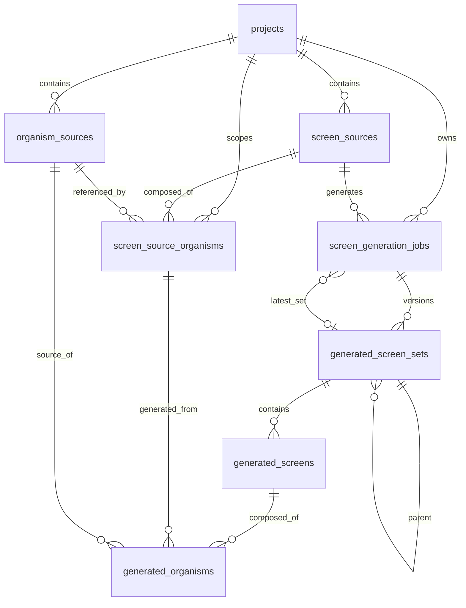

# RND Screen Generator ERD

```mermaid
erDiagram
  projects ||--o{ screen_sources : contains
  projects ||--o{ organism_sources : contains
  projects ||--o{ screen_source_organisms : scopes
  projects ||--o{ screen_generation_jobs : owns

  screen_sources ||--o{ screen_source_organisms : composed_of
  organism_sources ||--o{ screen_source_organisms : referenced_by

  screen_sources ||--o{ screen_generation_jobs : generates
  screen_generation_jobs ||--o{ generated_screen_sets : versions
  screen_generation_jobs }o--o| generated_screen_sets : latest_set

  generated_screen_sets ||--o{ generated_screen_sets : parent
  generated_screen_sets ||--o{ generated_screens : contains
  generated_screens ||--o{ generated_organisms : composed_of

  screen_source_organisms ||--o{ generated_organisms : generated_from
  organism_sources ||--o{ generated_organisms : source_of
```

